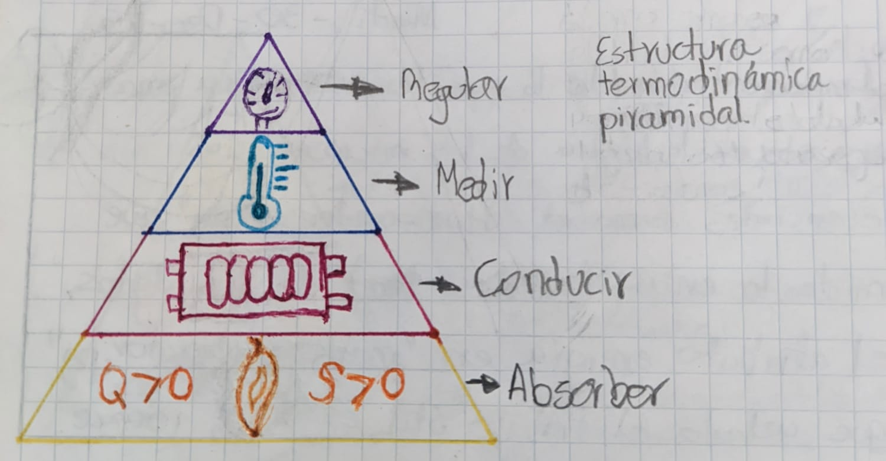
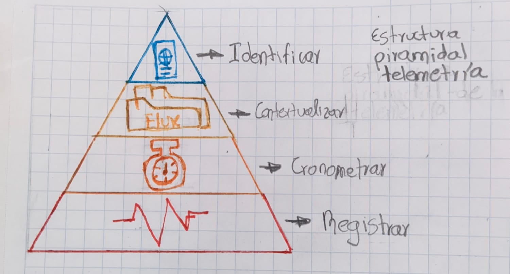

# 📂 Nivel 4: Los Archivos del Consejo

(La Evidencia Forense y la Caja de Cristal)
"La confianza no se exige; se demuestra. Aquí presentamos los entregables tangibles donde la matemática abstracta se convierte en decisiones de negocio."
En este nivel, aterrizamos la teoría. El sistema APU Filter no le entrega un simple "log" de errores; le entrega tres artefactos de inteligencia diseñados para la auditoría forense de su proyecto. Estos archivos son la materialización del trabajo del Consejo.

## 1. El Microscopio Estructural (Visualización Forense)

Fuente: Generado por `topology_viz.py` y `business_topology.py`.
El Arquitecto Estratega no solo calcula; dibuja. Transformamos su presupuesto en un grafo interactivo (usando Cytoscape.js) que permite una inspección visual inmediata de las patologías. No es un dibujo estático; es un mapa de calor de riesgos.

### La Leyenda del Mapa (Decodificación Visual)
El sistema colorea y etiqueta los nodos basándose en la gravedad del hallazgo matemático:

| Elemento Visual | Significado en Obra | Causa Técnica (Código) |
| :--- | :--- | :--- |
| 🔴 Nodos ROJOS | Punto de Falla Crítico. Elemento en riesgo de colapso, bloqueo o aislamiento. | `NodeColor.RED`: Detectado en anomaly_data (ciclos, estrés, islas) |
| 🟠 Borde PUNTEADO | Conexión Fantasma. Una relación que debería existir pero falta (ej. un APU sin insumos). | `style="dotted", color="orange"`: Detectado por get_missing_connections. |
| ⚡ Clase "STRESS" | Pirámide Invertida. Un insumo básico que soporta demasiada carga del proyecto. | `NodeClass.STRESS`: Insumos con in_degree desproporcionado (>30% del grafo). |
| 🔄 Clase "CIRCULAR" | Socavón Lógico. El nodo es parte de un bucle infinito de precios (A → B → A). | `NodeClass.CIRCULAR`: Pertenencia al conjunto nodes_in_cycles. |

La Experiencia de Usuario: Usted no busca errores fila por fila. Usted abre el visor y "sigue el rojo".

## 2. El Veredicto Ejecutivo (Narrativa Estratégica)

Fuente: Generado por `semantic_translator.py` y `business_agent.py`.
El Intérprete Diplomático toma los datos crudos y redacta un informe en lenguaje natural. No recibirá un JSON crudo; recibirá un Dictamen de Ingeniería.
Estructura del Informe (ConstructionRiskReport)
El sistema genera un objeto ConstructionRiskReport
 que se traduce en:
1. Puntuación de Integridad (Score 0-100):
    ◦ Cálculo: Se penaliza por ciclos (β1​>0), islas (β0​>1) y pirámides invertidas (Ψ<1).
    ◦ Ejemplo: "Integridad: 65/100 (Riesgo Alto)".
2. Narrativa de Estabilidad:
    ◦ Input: Ψ = 0.8
    ◦ Output: "📉 COLAPSO POR BASE ESTRECHA (Pirámide Invertida). La cimentación logística es demasiado angosta para soportar el peso táctico de los APUs."
3. Veredicto Financiero:
    ◦ Input: ROI < 0 o Volatilidad > 20%.
    ◦ Output: "🛑 Veredicto: RIESGO CRÍTICO. Estructura no financiable sin reingeniería."

## 3. El Diagnóstico Termodinámico (Física del Valor)

> **Flujo de Energía: Absorber (Base) -> Conducir -> Medir -> Regular (Cúspide)**

Evaluamos la eficiencia energética de su capital. No todos los gastos son iguales; distinguimos entre Exergía (trabajo útil estructural) y Anergía (desperdicio o acabados cosméticos).

## 4. El Electrocardiograma del Sistema (Telemetría OODA)

> **Ciclo de Observabilidad: Registrar -> Cronometrar -> Contextualizar -> Identificar**

Fuente: Generado por `apu_agent.py` y `flux_condenser.py`.
El Guardián del Umbral y el Agente Autónomo monitorean la salud del proceso de análisis en tiempo real. Usted puede ver el "pulso" del sistema para saber si sus datos son estables o caóticos.
El Ciclo OODA en Acción
El Agente ejecuta un bucle continuo de Observar-Orientar-Decidir-Actuar
, generando métricas físicas que usted puede auditar:
• ⚡ Voltaje de Flyback (flyback_voltage):
    ◦ Significado: ¿Qué tan inestables son los datos entrantes?
    ◦ Alerta: Si V>0.8, el sistema reporta: "Alta inestabilidad detectada. Los datos contienen cambios bruscos de formato o calidad."
• 🔥 Potencia Disipada (dissipated_power):
    ◦ Significado: ¿Cuánta energía estamos desperdiciando procesando "basura" (filas vacías, errores)?
    ◦ Acción: Si P>50W, el sistema activa el "Freno de Emergencia" térmico para evitar colapsos.
• 🌊 Saturación (saturation):
    ◦ Significado: Presión de datos en el pipeline.
    ◦ Meta: Mantener un "Flujo Laminar" al 30% de capacidad para máxima precisión.

## 5. La Bitácora Inmutable (Audit Trail)

Fuente: `data_validator.py` y `telemetry.py`.
Finalmente, para el auditor financiero, el sistema genera una traza completa. Nada se pierde.
• Identidad de la Sesión: Cada análisis tiene un session_id y un request_id único

• Evidencia de Validación:
    ◦ Cantidad Recalculada: "El sistema detectó Cantidad=0 pero Valor Total > 0. Se recalculó la cantidad implícita."
    ◦ Descripción Inferida: "Descripción faltante. Se infirió 'Cemento Gris' usando búsqueda difusa (Fuzzy Matching) con 95% de confianza."

## 6. La Arquitectura de los Sabios (Ecosistema V3)

El sistema opera bajo el mandato del Consejo Digital, una arquitectura de agentes especializados:
*   **FluxCondenser (El Guardián):** Estabiliza la entrada caótica de datos.
*   **TopologicalAnalyzer (El Arquitecto):** Evalúa la integridad estructural del grafo.
*   **FinancialEngine (El Oráculo):** Proyecta riesgos económicos y viabilidad.
*   **SemanticTranslator (El Diplomático):** Traduce matemáticas a lenguaje de negocio.

## 7. El Motor de Parsing Categórico

Fuente: `apu_processor.py` y `report_parser_crudo.py`
"La gramática es la estructura del pensamiento; el parsing es la validación de la realidad."

El sistema no utiliza simples expresiones regulares para leer sus archivos. Empleamos un motor basado en **Teoría de Categorías** que trata cada línea del presupuesto como una estructura algebraica que debe preservar ciertos invariantes topológicos.

### Mónadas para la Gestión de Incertidumbre
Utilizamos la mónada `OptionMonad` (Maybe) para encapsular la posibilidad de fallo en cada paso de la interpretación. Esto permite encadenar operaciones de transformación (bind/flatMap) sin corromper el flujo de datos con excepciones no controladas. Si una línea falla en ser interpretada, el sistema no "crasha"; colapsa la función de onda de esa línea en un estado de error controlado, preservando la estabilidad del sistema global.

### Homeomorfismo Estructural
Cada línea parseada se somete a una prueba de homeomorfismo: ¿Es la estructura sintáctica detectada (el árbol de derivación) topológicamente equivalente al esquema platónico de un Insumo APU?
Validamos:
1.  **Conectividad:** No deben existir "islas" de datos inconexos en una línea.
2.  **Densidad:** La relación señal/ruido debe superar el umbral de entropía.

### Métricas de Calidad de Parsing
Exponemos métricas profundas sobre la calidad de su información original:
*   **Entropía de Campo (H):** Mide el desorden en la tipificación de los datos. Un H alto indica inconsistencia en los formatos de entrada.
*   **Densidad Estructural (ρ):** Cantidad de información semántica útil por byte.
*   **Cohesión Numérica (C):** Qué tan "juntos" y relacionados están los valores numéricos, indicando si forman un vector de costos coherente o son datos dispersos.

Conclusión del Nivel 4: Al llegar aquí, usted tiene:
1. Un Mapa Visual de sus riesgos (Topología).
2. Un Dictamen Escrito de viabilidad (Semántica).
3. Un Reporte de Signos Vitales de la calidad de sus datos (Física).
4. Un Certificado de Coherencia Matemática de su fuente de datos (Categorías).
Esto es la Caja de Cristal.
