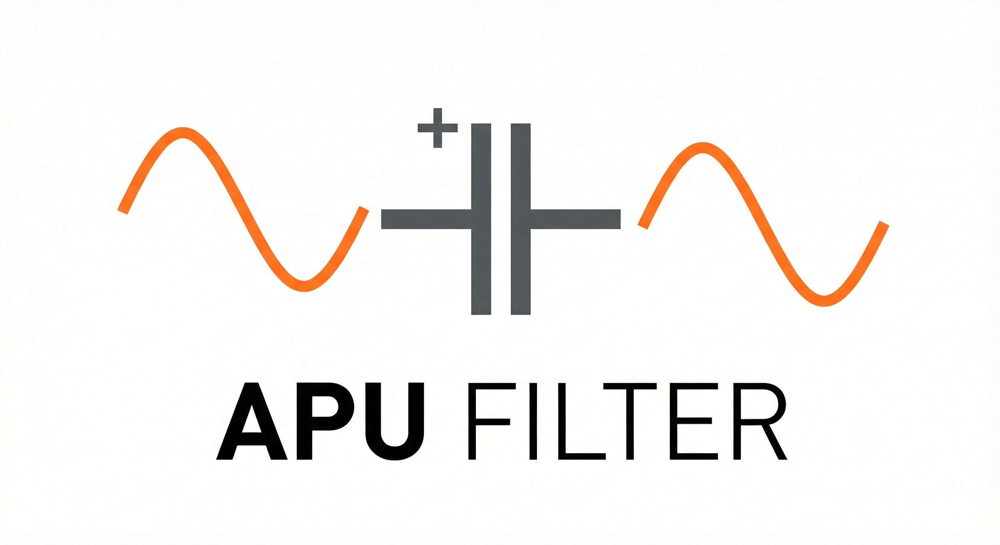

<div align="center">
  
</div>

# APU Filter: Inteligencia de Costos y Blindaje Financiero

### De Archivos Muertos a Memoria Viva: El Nuevo Activo Estratégico de su Constructora.

**"La volatilidad de los datos de APU no es un problema de software, es un problema de negocio que cuesta millones."**

En el sector de la construcción en Colombia, ganar una licitación con el precio incorrecto es peor que perderla. **APU Filter** no es otro software de gestión; es una plataforma de **Inteligencia de Costos** diseñada para transformar el caos de sus presupuestos históricos en una ventaja competitiva, protegiendo sus márgenes de utilidad contra la incertidumbre.

---

## El Manifiesto: Por Qué Construimos Esto

Los ingenieros de costos pasan el **40% de su tiempo** limpiando hojas de cálculo rotas y el otro **40%** reinventando la rueda (cotizando ítems que la empresa ya ha comprado mil veces).

Creamos APU Filter para eliminar esa fricción. No reemplazamos a sus ingenieros; extendemos y amplificamos su capacidad para tomar decisiones. Convertimos terabytes de "archivos muertos" (PDFs, Excels viejos) en una **Memoria Institucional Viva** que responde preguntas críticas en segundos.

---

## Arquitectura del Ecosistema

La arquitectura del proyecto ha evolucionado a un sistema de microservicios orquestado, diseñado para alta disponibilidad y separación de responsabilidades. La **Tríada Operativa** se compone de:

1.  **El Núcleo (Core):** Servidor Flask + Gunicorn (Puerto 5002). Procesa la física de los datos, la lógica de negocio (Flux Physics, Pipeline) y expone la API.
2.  **La Memoria (Redis):** Gestión de sesiones, colas de mensajes y caché de alta velocidad para la comunicación eficiente entre procesos.
3.  **El Agente (Agent):** Orquestador inteligente dividido en responsabilidades claras:
    *   **APU Agent (SRE):** Monitorea la salud técnica (`agent/apu_agent.py`), optimiza el flujo de datos y gestiona tareas de mantenimiento.
    *   **Business Agent (CFO):** Ejecuta la lógica financiera y estratégica (`agent/business_agent.py`), aplicando WACC, VaR y análisis topológico de costos.

---

## Su Nuevo Equipo Digital

Internamente, el Núcleo (Core) opera no como scripts aislados, sino como un **Equipo de Expertos** especializados.

### 1. El Director (`pipeline_director.py`)
**Rol:** Orquestador del Flujo.
**Misión:** Es el jefe de obra digital. Define la secuencia: Carga -> Limpieza -> Estabilización -> Cirugía -> Estimación. Garantiza que el proceso sea ordenado y auditable.

### 2. El Guardia (`report_parser_crudo.py`)
**Rol:** Seguridad de Entrada.
**Misión:** Detiene los datos corruptos en la puerta. Analiza la estructura de los archivos entrantes (CSV, Excel) y decide si cumplen con los estándares mínimos de calidad.

### 3. El Estabilizador (`flux_condenser.py`)
**Rol:** Control de Flujo y Resiliencia.
**Misión:** Implementa patrones de **Backpressure y Control Adaptativo** para actuar como un amortiguador industrial. Gestiona la tasa de procesamiento dinámicamente, absorbiendo picos de carga.

### 4. El Cirujano (`apu_processor.py`)
**Rol:** Precisión Estructural.
**Misión:** Con el dato ya estabilizado, disecciona cada línea de costo. Separa materiales, mano de obra y equipos con precisión milimétrica, normalizando unidades y descripciones.

### 5. El Estratega (`estimator.py`)
**Rol:** Inteligencia de Mercado (Caja Blanca).
**Misión:** Utiliza **Búsqueda Semántica** para encontrar precios históricos y proyecta escenarios de riesgo. Muestra la evidencia y el nivel de certeza para que el ingeniero humano tenga la última palabra.

---

## Soluciones Reales a Dolores de Obra

| Dolor del Negocio | Solución Técnica | Beneficio Directo |
| :--- | :--- | :--- |
| **"Perdemos días limpiando Excels de contratistas."** | **Motor de Ingesta Resiliente** (Control Adaptativo + PID) | **Continuidad Operativa:** Procese archivos corruptos o masivos sin que el sistema se detenga. |
| **"Cada ingeniero cotiza precios diferentes para lo mismo."** | **Memoria Institucional Inteligente** (Vectores FAISS) | **Estandarización:** Recupere la "verdad" de la empresa. Si ya se cotizó, el sistema lo sabe. |
| **"Nos da miedo que el precio del acero suba y perdamos plata."** | **Radar de Riesgo Financiero** (Simulación Monte Carlo) | **Protección de Margen:** Conozca la probabilidad matemática de pérdida antes de enviar la oferta. |

---

## Instalación: El Enfoque Dual

Seleccione el método de despliegue que mejor se adapte a sus necesidades.

### A. Despliegue Rápido / Producción (Recomendado)
Ideal para demostraciones, pruebas de integración y entornos estables. Utiliza contenedores aislados para garantizar que "funcione en todas partes".

**Requisitos:** [Podman](https://podman.io/) (o Docker) y `podman-compose`.

1.  **Ejecutar el script de arranque:**
    ```bash
    ./start_podman.sh
    ```
    Este comando automatiza todo el ciclo de vida:
    *   Configura los registros de contenedores (automáticamente vía `scripts/setup_podman_registry.sh`).
    *   Construye las imágenes del Core y el Agente.
    *   Levanta la infraestructura completa (Core, Redis, Agent) en una red orquestada.

2.  **Verificar:** El sistema estará disponible en `http://localhost:5002`.

### B. Modo Desarrollador / Ingeniería
Ideal para modificar el código fuente, depurar lógica interna o correr la suite de pruebas unitarias.

**Requisitos:** [Miniconda](https://docs.conda.io/en/latest/miniconda.html) (o Anaconda).

1.  **Ejecutar el script de entorno:**
    ```bash
    ./start_conda.sh
    ```
    Este script realiza una configuración profunda:
    *   Crea un entorno aislado (`apu_filter_env`).
    *   Instala dependencias complejas (PyTorch CPU, FAISS, Redis) y optimizadas con `uv`.
    *   Prepara los datos y genera embeddings iniciales.

2.  **Activar el entorno:**
    ```bash
    conda activate apu_filter_env
    ```

3.  **Ejecutar pruebas o servidor:**
    ```bash
    # Correr pruebas
    python -m pytest

    # Levantar servidor manualmente
    python -m flask run --port=5002
    ```

---

## Ingeniería Bajo el Capó (La Validación Técnica)

<div align="center">
  
</div>

Para el equipo de TI: Usamos una arquitectura modular en Python (Flask, Pandas, PyTorch/FAISS) con principios SRE (Site Reliability Engineering) para garantizar robustez.

### Configurabilidad Declarativa
Creemos que las reglas de negocio no deben estar "quemadas" en el código.
*   **Separación de Poderes:** Toda la lógica de negocio (mapeo de columnas, umbrales de validación, reglas de categorización) vive en archivos de configuración externos (`config.json`).
*   **Adaptabilidad:** ¿Cambió el formato del Excel del proveedor? Ajuste el JSON, no el código Python. Esto permite que el sistema evolucione a la velocidad del negocio sin requerir refactorización constante.

### Transparencia de Caja Blanca
En un sector donde la responsabilidad legal es alta, "la IA lo dijo" no es una defensa válida.
*   **Auditabilidad:** Cada estimación viene acompañada de un log de decisión detallado: "¿Por qué elegí este precio? Porque tiene una similitud semántica del 94% con el Proyecto X del año pasado".
*   **Control Humano:** La herramienta propone, el ingeniero dispone.

Ver `app/metodos.md` para detalles profundos sobre el Motor de Estabilidad y la Lógica de Estimación.
