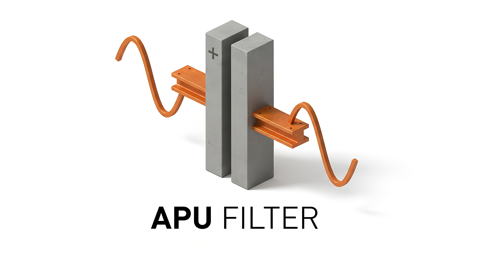

<div align="center">
  
</div>

# APU Filter: Consejo de Sabios Digitales

### De Software a Equipo de Élite: Su Protección que mitiga la Incertidumbre.

**"Bienvenido a la sala del Consejo de APU_filter. Un grupo de expertos digitales delibera para proteger la integridad de su presupuesto."**

En la construcción, el riesgo no es solo técnico; es existencial. Un error en una hoja de cálculo no es un número incorrecto; es una obra paralizada.
Bienvenido a **APU Filter**. No somos una simple herramienta de validación de precios; somos una Arquitectura Cognitiva diseñada para proteger la integridad de su presupuesto. Transformamos la gestión de costos, pasando de ser una tarea solitaria y propensa al error, a una deliberación estratégica respaldada por evidencia matemática y financiera

---
## 🌐 La Intersección: Donde la Magia Ocurre

La mayoría del software ve su presupuesto como una lista plana de ítems. Nosotros lo vemos como un organismo vivo. APU Filter opera en la frontera inexplorada donde convergen tres disciplinas para garantizar un "Costo Sano":
1. La Construcción (El Territorio): Entendemos la realidad física de loa datos. Sabemos que si falta el cemento, el muro no se construye, sin importar qué diga el Excel.
2. La Topología Algebraica (El Mapa): Utilizamos matemáticas avanzadas para leer la "forma" de sus datos. Detectamos socavones lógicos (ciclos infinitos donde A depende de B y B depende de A) e islas desconectadas (recursos que se compran pero no se usan).
3. La Ingeniería Financiera (El Riesgo): Aplicamos modelos de flujo y presión (física de fluidos y circuitos RLC) para medir la "fricción" de sus datos y predecir sobrecostos antes de que se materialice

---
## El Camino del Iniciado

Hemos estructurado la interacción con el sistema en 4 niveles para guiarle desde la visión hasta la evidencia profunda:

1. **La Promesa (Usted está aquí):** Entender el valor de un "Costo Sano".
2. **[Conociendo a los Sabios (SAGES.md)](SAGES.md):** Conozca a los expertos digitales que trabajarán para usted.
3. **[El Lenguaje Secreto (ARCHITECTURE_DEEP_DIVE.md)](ARCHITECTURE_DEEP_DIVE.md):** Descubra cómo convertimos matemáticas avanzadas en auditoría civil.
4. **Los Archivos del Consejo:** Acceda al Dashboard y Reportes para ver el Diagnóstico, Impacto y Acción.

---

## Instalación del Entorno de Consejería

Para convocar a su Consejo, seleccione el método de despliegue:

### A. Sala de Juntas Ejecutiva (Producción con Podman)
Despliegue rápido y aislado.
```bash
./start_podman.sh
```

### B. Laboratorio de Investigación (Desarrollo con Conda)
Acceso profundo a la lógica de los expertos.
```bash
./start_conda.sh
conda activate apu_filter_env
```

---

*APU Filter: Transformando el Silencio Técnico en Sabiduría Accionable.*
