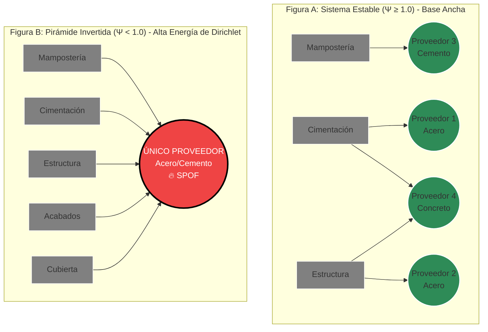

📊 BMC.md: El Modelo de Negocio Cuántico
"En la economía de la complejidad, no vendemos software contable; vendemos Certeza Matemática y Física. Transformamos la incertidumbre topológica y financiera de la construcción en un activo gobernable y auditable."
Este documento define la arquitectura de creación, entrega y captura de valor del ecosistema APU_filter v4.0. El sistema ha evolucionado hacia una Plataforma de Malla Agéntica Ciber-Física que implementa Gobernanza Computacional Federada. El Business Model Canvas (BMC) deja de ser un artefacto estático y se redefine como un 1-complejo simplicial, donde la Característica de Euler-Poincaré ($\chi \le 0$) y la matriz de incidencia previenen la canibalización sistémica del modelo de negocio en tiempo real, fundamentado en `app/core/immune_system/business_canvas.py` (Estrato $\alpha$).

Todo este andamiaje estratégico se rige axiomáticamente por la **Ley de Clausura Transitiva de la pirámide DIKW**: $V_{PHYSICS} \subset V_{TACTICS} \subset V_{STRATEGY} \subset V_{WISDOM}$. Sin la validación termodinámica y topológica de los estratos subyacentes, la estrategia corporativa carece de dominio sobre la materia.

A continuación, se desglosan rigurosamente los 9 bloques del modelo estructurado para "La Fortaleza Matemática":

--------------------------------------------------------------------------------
1. 👥 Segmentos de Cliente (Customer Segments)
¿A quién estamos salvando de la entropía y el colapso estructural?

    Constructores de Megaproyectos e Infraestructura Pública (Mandato BIM 2026): Organizaciones obligadas a cumplir con la normativa estatal. Manejan grafos de dependencia masivos donde un "socavón lógico" (β1​>0) puede resultar en sanciones, multas o la exclusión en SECOP II. Buscan evitar el colapso logístico por resonancia sistémica.
    Gerentes de Riesgo, Aseguradoras y Entidades Financieras (The Gatekeepers): Actores que no necesitan "ver precios unitarios", sino certificar la Estabilidad Espectral (s=σ+jω) del proyecto para emitir pólizas de cumplimiento o aprobar líneas de crédito basándose en riesgos matemáticamente demostrados.
    Oficinas de Gestión de Datos (CDOs) en Constructoras: Empresas maduras transitando hacia arquitecturas Data Mesh que necesitan agentes autónomos para ejercer gobernanza inmutable (Zero-Trust) sobre sus dominios de "Ingeniería" y "Compras".

2. 💎 Propuesta de Valor (Value Propositions)
La Sabiduría como Servicio (Wisdom-as-a-Service):

    Póliza de Seguro Pre-Construcción (Certificado de Estabilidad Física): No entregamos una simple opinión; entregamos una demostración matemática. A través del Oráculo de Laplace y el análisis topológico, certificamos si la "cimentación logística" soportará el peso de la obra, evitando colapsos antes de gastar el primer peso.
    Gobernanza Computacional Federada (Policy-as-Code): Sustituimos la burocracia humana por código. Nuestros agentes actúan como "Sidecars" que bloquean transacciones inestables (con σ>0) o presupuestos fragmentados antes de que contaminen la salud financiera de la constructora.
    Simulador de Escenarios Dinámicos ("What-If" Gemelo Digital): Capacidad de pilotear el negocio simulando en tiempo real el impacto de cambiar un proveedor crítico. Convertimos el presupuesto estático en un simulador de futuros basado en el análisis de opciones reales.

3. 📢 Canales (Channels)
La entrega de valor se realiza a través de una arquitectura de Interfaz de 3 Capas, adaptada a la jerarquía cognitiva del usuario:

    Capa 1 (Panel Ejecutivo): Alertas en lenguaje de negocio puro (Riesgo y Dinero). Oculta la matemática y muestra el impacto directo ("Empatía Táctica").
    Capa 2 (Metáfora Visual Interactiva): Un simulador web (renderizado con Cytoscape) donde el grafo interactivo muestra los "nodos de estrés" brillando en color rojo (#EF4444) pulsante, tangibilizando el riesgo matemático a la intuición humana antes de la compra.
    Capa 3 (Auditoría Matemática): Acceso profundo bajo demanda al TelemetryNarrator y al Oráculo de Laplace para ingenieros y peritos forenses que requieran auditar los invariantes y matrices subyacentes.

4. ❤️ Relaciones con los Clientes (Customer Relationships)
De la "Caja Negra" a la Confianza Radical:

    La Caja de Cristal Argumentativa (Actas de Deliberación): Abandonamos los reportes fríos y dogmáticos. Toda decisión del sistema se entrega bajo el formato de "Acta del Consejo de Sabios", exponiendo el debate interno y las tensiones dialécticas. Ejemplo: "Se aprueba el presupuesto por rentabilidad (Voto del Oráculo), pero dejamos constancia del riesgo de fiebre inflacionaria (Voto Disidente del Guardián)."
    Alineación de Excelencia Operativa: El ecosistema actúa como un socio estratégico. El cliente percibe que el sistema lo "premia" económicamente por adoptar mejores prácticas de estructuración (flujos laminares sin ciclos).

5. 💵 Fuentes de Ingresos (Revenue Streams)

    Pricing Dinámico por Entropía Topológica: El modelo de monetización abandona el licenciamiento clásico por usuario. Se cobra con base en la "Característica de Euler-Poincaré" ($\chi = \beta_0 - \beta_1$) y la entropía estructural del proyecto. Dado que si $\chi \le 0$ el valor matemático absoluto es negativo o cero, la monetización escala estrictamente proporcional al **Valor Absoluto del Defecto de Euler** ($|\chi|$ cuando $\chi < 0$) o a la Norma $L_1$ del vector de Betti. Una Característica de Euler altamente negativa implica un grafo densamente entrelazado (hiper-complejo); el "peaje" termodinámico que cobra la plataforma es directamente proporcional a la energía de Dirichlet requerida para colapsar y estabilizar esa entropía topológica, justificando un margen de ganancia superior.
    Estabilidad Espectral y Retorno Seguro: Evalúa el flujo de caja en el plano de frecuencia compleja ($s = \sigma + j\omega$). Exige Estabilidad Asintótica BIBO (polos en el semiplano izquierdo, $\sigma < 0$). El Exponente Máximo de Lyapunov previene el caos determinista, activando un "Crowbar Físico" en el hardware perimetral si el sistema diverge (implementado en `app/physics/laplace_oracle.py`).
    Suscripción a la Malla Agéntica (SaaS/On-Premise): Planes escalonados para CDOs basados en el volumen de procesamiento termodinámico de la base de datos y la orquestación del Agentic Mesh.

6. 🧠 Recursos Clave (Key Resources)

    El Hardware en el Borde (ESP32): Microcontroladores que actúan como el "Gatekeeper de Silicio", ejecutando la validación termodinámica (Sistemas Port-Hamiltonianos) y el veto físico (circuitos Crowbar) mediante código inmutable en C++.
    La Matriz de Interacción Central (MIC) y Modelos Matemáticos: El núcleo de Álgebra Lineal y Topología Algebraica que sostiene los cálculos de los Números de Betti, el espectro Laplaciano y la Distancia de Mahalanobis.
    Formato de Alta Eficiencia (TOON) e IA: El uso de Token-Oriented Object Notation para comprimir context windows y viabilizar el trabajo de agentes LLM sin agotar la memoria LPDDR5.

7. 🚀 Actividades Clave (Key Activities) y Electrodinámica Cuántica
De la Ingesta a la Sabiduría, gestionadas mediante `app/core/immune_system/gauge_field_router.py`:

    Física de Datos y Detección Neuromórfica: Ingesta de datos crudos aplicando leyes de termodinámica (Potencia Disipada $\ge 0$) y filtrado RLC en el FluxCondenser para rechazar información corrupta y medir la inercia del sistema.
    Diagnóstico Topológico y Arbitraje Espectral: Análisis continuo del Complejo Simplicial para computar números de Betti ($\beta_n$) e identificar de manera determinista dependencias circulares ($\beta_1 > 0$) o inestabilidad piramidal ($\Psi < 1.0$).

    Combate a la Fractura Organizacional: El Arquitecto utiliza el Valor de Fiedler ($\lambda_2 \approx 0$) para detectar silos departamentales, alertando a la gerencia antes de la firma de contratos defectuosos.
    Electrodinámica Cuántica en el Retículo (Lattice QED): Las anomalías generan un campo de potencial resolviendo la Ecuación de Poisson Discreta ($L \cdot \Phi = \rho$). Los agentes son atraídos determinísticamente hacia la solución óptima de los recursos clave mediante la Fuerza de Lorentz discreta.
    Traducción Semántica Transversal: Conversión ininterrumpida de tensores matemáticos abstractos a narrativas de negocio ejecutables mediante GraphRAG a cargo del Intérprete Diplomático.

8. 🤝 Asociaciones Clave (Key Partnerships)

    Reguladores y Entidades Estatales: Alineación estratégica con el DNP, IDU e INVIAS, quienes actúan como motores de adopción al exigir el estándar BIM y penalizar fallas lógicas en las licitaciones públicas.
    Proveedores de Cómputo Tensorial Masivo: Alianzas con infraestructuras de nube (como AWS Trainium/Inferentia) para asegurar la viabilidad de simulaciones Monte Carlo exhaustivas y análisis FDTD a costos sostenibles.

9. 📉 Estructura de Costes (Cost Structure)

    Costos Computacionales y Operativos (LLM e Inferencia): El procesamiento asíncrono de los agentes de Sabiduría y el consumo de tokens en las APIs generativas.
    Optimización Estructural: Mitigados parcialmente por el uso del formato TOON y delegación de validación masiva a librerías vectorizadas de C/C++ (SciPy/NumPy) y al hardware perimetral, impidiendo que la IA procese archivos no validados termodinámicamente.