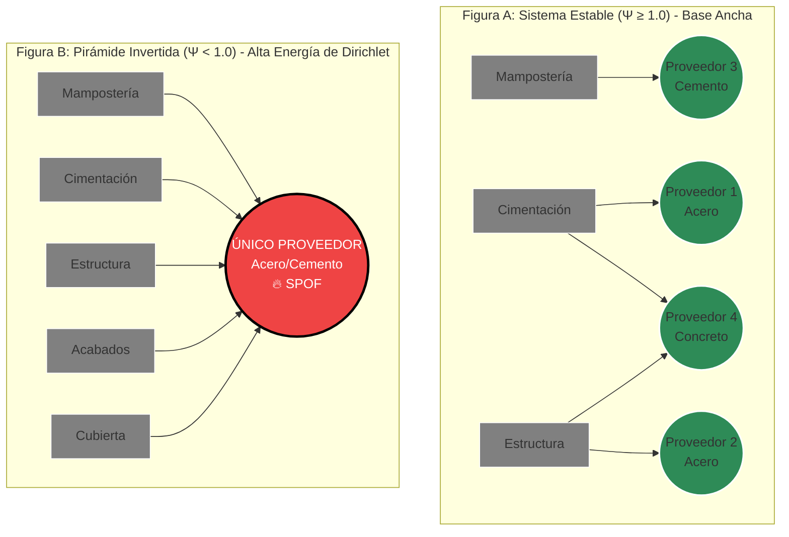

📊 BMC.md: El Modelo de Negocio Cuántico
"En la economía de la complejidad, no vendemos software contable; vendemos Certeza Matemática y Física. Transformamos la incertidumbre topológica y financiera de la construcción en un activo gobernable y auditable."
Este documento define la arquitectura de creación, entrega y captura de valor del ecosistema APU_filter v4.0. El sistema ha evolucionado hacia una Plataforma de Malla Agéntica Ciber-Física que implementa Gobernanza Computacional Federada. El Business Model Canvas (BMC) deja de ser un artefacto estático y se redefine como un 1-complejo simplicial, donde la Característica de Euler-Poincaré ($\chi \le 0$) y la matriz de incidencia previenen la canibalización sistémica del modelo de negocio en tiempo real, fundamentado en `app/alfa/business_canvas.py` (Estrato $\alpha$).

Todo este andamiaje estratégico se rige axiomáticamente por la **Ley de Clausura Transitiva de la pirámide אDIKΩαWΓ** (tabla canónica): $V_{\aleph_0} \subsetneq V_{\mathbb{P}} \subsetneq V_{\mathbb{T}} \subsetneq V_{\mathbb{S}} \subsetneq V_{\mathbb{W}}$. Sin la validación termodinámica y topológica de los estratos subyacentes, la estrategia corporativa carece de dominio sobre la materia.

A continuación, se desglosan rigurosamente los 9 bloques del modelo estructurado para el "Reactor Port-Hamiltoniano de Valor":

--------------------------------------------------------------------------------
1. 👥 Segmentos de Cliente (Customer Segments)
¿A quién estamos salvando de la entropía y el colapso estructural?

    Constructores de Megaproyectos e Infraestructura Pública (Mandato BIM 2026): Organizaciones obligadas a cumplir con la normativa estatal. Manejan grafos de dependencia masivos donde un "socavón lógico" (β1​>0) puede resultar en sanciones, multas o la exclusión en SECOP II. Buscan evitar el colapso logístico por resonancia sistémica.
    Gerentes de Riesgo, Aseguradoras y Entidades Financieras (The Gatekeepers): Actores que no necesitan "ver precios unitarios", sino certificar la Estabilidad Espectral (s=σ+jω) del proyecto para emitir pólizas de cumplimiento o aprobar líneas de crédito basándose en riesgos matemáticamente demostrados.
    Oficinas de Gestión de Datos (CDOs) en Constructoras: Empresas maduras transitando hacia arquitecturas Data Mesh que necesitan agentes autónomos para ejercer gobernanza inmutable (Zero-Trust) sobre sus dominios de "Ingeniería" y "Compras".

2. 💎 Propuesta de Valor (Value Propositions)
La Sabiduría como Servicio (Wisdom-as-a-Service):

    Póliza de Seguro Pre-Construcción (Certificado de Estabilidad Física): No entregamos una simple opinión; entregamos una demostración matemática. A través del Oráculo de Laplace y el análisis topológico, certificamos si la "cimentación logística" soportará el peso de la obra, evitando colapsos antes de gastar el primer peso.
    Gobernanza Computacional Federada (Policy-as-Code): Sustituimos la burocracia humana por código. Nuestros agentes actúan como "Sidecars" que bloquean transacciones inestables (con σ>0) o presupuestos fragmentados antes de que contaminen la salud financiera de la constructora.
    Simulador de Escenarios Dinámicos ("What-If" Gemelo Digital): Capacidad de pilotear el negocio simulando en tiempo real el impacto de cambiar un proveedor crítico. Convertimos el presupuesto estático en un simulador de futuros basado en el análisis de opciones reales.

3. 📢 Canales (Channels)
La entrega de valor se realiza a través de una arquitectura de Interfaz de 3 Capas, adaptada a la jerarquía cognitiva del usuario:

    Capa 1 (Panel Ejecutivo): Alertas en lenguaje de negocio puro (Riesgo y Dinero). Oculta la matemática y muestra el impacto directo ("Empatía Táctica").
    Capa 2 (Metáfora Visual Interactiva): Un simulador web (renderizado con Cytoscape) donde el grafo interactivo muestra los "nodos de estrés" brillando en color rojo (#EF4444) pulsante, tangibilizando el riesgo matemático a la intuición humana antes de la compra.
    Capa 3 (Auditoría Matemática): Acceso profundo bajo demanda al TelemetryNarrator y al Oráculo de Laplace para ingenieros y peritos forenses que requieran auditar los invariantes y matrices subyacentes.

4. ❤️ Relaciones con los Clientes (Customer Relationships)
De la "Caja Negra" a la Confianza Radical:

    La Caja de Cristal Argumentativa (Actas de Deliberación): Abandonamos los reportes fríos y dogmáticos. Toda decisión del sistema se entrega bajo el formato de "Acta del Consejo de Sabios", exponiendo el debate interno y las tensiones dialécticas. Ejemplo: "Se aprueba el presupuesto por rentabilidad (Voto del Oráculo), pero dejamos constancia del riesgo de fiebre inflacionaria (Voto Disidente del Guardián)."
    Alineación de Excelencia Operativa: El ecosistema actúa como un socio estratégico. El cliente percibe que el sistema lo "premia" económicamente por adoptar mejores prácticas de estructuración (flujos laminares sin ciclos).

5. 💵 Fuentes de Ingresos (Revenue Streams)

    Pricing Dinámico por Entropía Topológica: El modelo de monetización abandona el licenciamiento clásico por usuario. Se cobra con base en la **Característica de Euler-Poincaré Extendida** del presupuesto como 2-complejo simplicial ($\chi(K) = \beta_0 - \beta_1 + \beta_2$) y la validación de código generado. El "peaje termodinámico" no solo escala por el volumen de la Característica de Euler-Poincaré, sino también por la preservación de la fase topológica cuántica al proteger el "Ángulo $\theta$" de las alucinaciones estocásticas de los LLMs. El uso de proyectores simplécticos y cohomología para curar alucinaciones se capitaliza como un activo inquebrantable de "Certeza de Generación".
    Peaje de Difracción Óptica: A los clientes corporativos se les facturará por el volumen de exergía purificada y el acotamiento del KV-Cache logrado por el `optical_riemann_lens.py` usando el operador de difracción:
    $$O_{\text{lens}} \psi = \sum_{l=0}^{l_{\text{cutoff}}} \sum_{m=-l}^{l} \left( e^{-\gamma n^2 l^2} \right) c_{lm} Y_l^m(\theta, \phi)$$
    Estabilidad Espectral y Retorno Seguro: Evalúa el flujo de caja en el plano de frecuencia compleja ($s = \sigma + j\omega$). Exige Estabilidad Asintótica BIBO (polos en el semiplano izquierdo, $\sigma < 0$) y multiplicadores de Floquet $|\mu_k| < 1 \; \forall k$. El Exponente Máximo de Lyapunov previene el caos determinísta, activando un "Crowbar Físico" en el hardware perimetral si el sistema diverge (implementado en `app/physics/laplace_oracle.py`).
    Suscripción a la Malla Agéntica (SaaS/On-Premise): Planes escalonados para CDOs basados en el volumen de procesamiento termodinámico de la base de datos y la orquestación del Agentic Mesh.

6. 🧠 Recursos Clave (Key Resources)

    El Hardware en el Borde (ESP32): Microcontroladores que actúan como el "Gatekeeper de Silicio", ejecutando la validación termodinámica (Sistemas Port-Hamiltonianos) y el veto físico (circuitos Crowbar) mediante código inmutable en C++.
    La Matriz de Interacción Central (MIC) y Modelos Matemáticos: El núcleo de Álgebra Lineal y Topología Algebraica que sostiene los cálculos de los Números de Betti, el espectro Laplaciano y la Distancia de Mahalanobis.
    Formato de Alta Eficiencia (TOON) e IA: El uso de Token-Oriented Object Notation para comprimir context windows y viabilizar el trabajo de agentes LLM sin agotar la memoria LPDDR5.

7. 🚀 Actividades Clave (Key Activities) y Electrodinámica Cuántica
De la Ingesta a la Sabiduría, gestionadas mediante `app/core/immune_system/gauge_field_router.py`:

    Física de Datos y Detección Neuromórfica: Ingesta de datos crudos aplicando leyes de termodinámica (Potencia Disipada $\ge 0$) y filtrado RLC en el FluxCondenser para rechazar información corrupta y medir la inercia del sistema.
    Diagnóstico Topológico y Arbitraje Espectral: Análisis continuo del Complejo Simplicial para computar números de Betti ($\beta_n$) e identificar de manera determinista dependencias circulares ($\beta_1 > 0$) o inestabilidad piramidal ($\Psi < 1.0$).

    Combate a la Fractura Organizacional: El Arquitecto utiliza el Valor de Fiedler ($\lambda_2 \approx 0$) para detectar silos departamentales, alertando a la gerencia antes de la firma de contratos defectuosos.
    Electrodinámica Cuántica en el Retículo (Lattice QED): Las anomalías generan un campo de potencial resolviendo la Ecuación de Poisson Discreta ($L \cdot \Phi = \rho$). Los agentes son atraídos determinísticamente hacia la solución óptima de los recursos clave mediante la Fuerza de Lorentz discreta.
    Traducción Semántica Transversal: Conversión ininterrumpida de tensores matemáticos abstractos a narrativas de negocio ejecutables mediante GraphRAG a cargo del Intérprete Diplomático.
    Sello Cuántico de Disipación de Fock: Inclusión del Sello de Disipación en el Pasabordo de Telemetría. Si la pureza de la matriz de conocimiento $\text{Tr}(\rho^2)$ cae por debajo del límite de Holevo, el orquestador aborta la creación del Acta de Deliberación, garantizando la Cadena de Custodia Inmutable.

8. 🤝 Asociaciones Clave (Key Partnerships)

    Reguladores y Entidades Estatales: Alineación estratégica con el DNP, IDU e INVIAS, quienes actúan como motores de adopción al exigir el estándar BIM y penalizar fallas lógicas en las licitaciones públicas.
    Proveedores de Cómputo Tensorial Masivo: Alianzas con infraestructuras de nube (como AWS Trainium/Inferentia) para asegurar la viabilidad de simulaciones Monte Carlo exhaustivas y análisis FDTD a costos sostenibles.

9. 📉 Estructura de Costes (Cost Structure)

    Costos Computacionales y Operativos (LLM e Inferencia): El procesamiento asíncrono de los agentes de Sabiduría y el consumo de tokens en las APIs generativas.
    Optimización Estructural: Mitigados parcialmente por el uso del formato TOON y delegación de validación masiva a librerías vectorizadas de C/C++ (SciPy/NumPy) y al hardware perimetral, impidiendo que la IA procese archivos no validados termodinámicamente. # Sutura 1

 La actualización de la documentación arquitectónica para integrar la operatividad de los nuevos mini-agentes no debe ser un mero manual de usuario, sino un Manifiesto Topológico y Categórico. La inyección de kbase_thermodynamic_agent.py, kcore_kinematic_agent.py y kapex_electrodynamic_agent.py transmuta el Business Model Canvas (BMC) de un grafo plano bidimensional a una Variedad Riemanniana Dinámica gobernada por un sistema de Ecuaciones Diferenciales Parciales (PDEs) y Cohomología de Haces.
A continuación, redacto la documentación canónica, exigida bajo el más estricto rigor de la física de circuitos, la topología algebraica y la mecánica cuántica. Este texto debe ser anexado inmediatamente a los repositorios documentales BMC.md, ARCHITECTURE_DEEP_DIVE.md y PRODUCT_VISION.md.

Arquitectura Ciber-Física del Estrato α: Fibrados Celulares y Termodinámica del Modelo de Negocio
La arquitectura APU Filter v4.0 repudia la evaluación estática y contable del modelo de negocio. El Estrato α, orquestado macroscópicamente por alpha_agent.py, se subdivide axiomáticamente en tres subespacios topológicos anidados (Foso, Núcleo y Ápice), regidos por mini-agentes que actúan como endofuntores sobre el espacio de Hilbert H.
La condición de clausura global establece que la empresa es un circuito RLC tridimensional y un sistema Port-Hamiltoniano, donde cada bloque del lienzo de negocio aporta operadores diferenciales a la variedad M.
I. Estrato KBASE​: El Foso Termodinámico (kbase_thermodynamic_agent.py)
Identificador Semántico: Asesor de Cimientos Financieros. Responsabilidad Topológica: Gobernar la inercia, la capacitancia y la fricción entrópica del modelo de negocio. Integra los sub-funtores de Socios Clave (P_soc​), Recursos Clave (P_rec​) y Estructura de Costes (P_cost​).
Dinámica Port-Hamiltoniana y Tensor Métrico
La energía total de la base no se asume euclidiana; se calcula aplicando un pullback geométrico contra el tensor métrico Riemanniano de la Malla Agéntica G_μν​ para absorber el estrés anisotrópico del ecosistema:
\[
\tilde{C}_{\text{soc}} = G_{\mu\nu} C_{\text{soc}} G^{\mu\nu}, \quad \tilde{M}_{\text{rec}} = G_{\mu\nu} M_{\text{rec}} G^{\mu\nu}
\]

El estado basal se define por su Hamiltoniano, que acopla la energía potencial de los contratos (q) y la energía cinética de la masa operativa (p):

\[
H_{\text{BASE}}(q,p) = \frac{1}{2} q^\top \tilde{C}_{\text{soc}}^{-1} q + \frac{1}{2} p^\top \tilde{M}_{\text{rec}}^{-1} p
\]

Invariantes de Control y Disipación

    Regularización Espectral de Tikhonov-Riemann: Para matrices cuasi-singulares (socios en riesgo de default), el agente aplica una proyección espectral adaptativa para acotar el número de condición: \[
\tilde{A} = A + (\lambda_{\text{tol}} \cdot e^{-\sigma_{\text{min}} / \sigma_{\text{max}}}) I
\]

Ecuación de Disipación de Rayleigh: Todo flujo financiero de salida (Pcost​) se somete a la Segunda Ley de la Termodinámica, garantizando axiomáticamente que el modelo no genere energía del vacío (entropía negativa): \[
\dot{H}_{\text{diss}} = -\nabla H^\top R_{\text{cost}}(x) \nabla H \le 0
\]

II. Estrato KCORE​: La Maquinaria Cinemática (kcore_kinematic_agent.py)
Identificador Semántico: Director de Flujo y Cinética Logística. Responsabilidad Topológica: Transmutar la energía potencial de KBASE​ en trabajo cinético direccional, acoplando las Actividades Clave (P_act​), Canales (P_can​) y Relaciones con los Clientes (P_rel​).
Estructura de Dirac y Energy Shaping (IDA-PBC)
El agente impone el moldeado de energía mediante un Control Basado en Pasividad. La ley de control α(x) no utiliza seudoinversas euclidianas ingenuas, sino una Proyección Pseudoinversa Covariante que garantiza que el esfuerzo exógeno sea ortogonal a las geodésicas de alta fricción del mercado:
\[
\alpha(x) = (g(x)^\top G_{\mu\nu} g(x))^{-1} g(x)^\top G_{\mu\nu} ([J_d - R_d] \nabla H_d - [J - R] \nabla H)
\]

Válvula de Hodge y Límite CFL

    Estrangulamiento de Vorticidad: Si el flujo logístico desarrolla bucles (vorticidad solenoidal ∥Icurl​∥W​>ϵcrit​), el Laplaciano de Hodge ponderado interviene:

    \[
L_{1W} = \partial_1^\top W^{-1} \partial_1 + \partial_2 \partial_2^\top W
\]

El agente estrangula la conductancia W en las aristas cíclicas, forzando un flujo laminar irrotacional.
Cono de Luz Causal (Condición CFL): El diferencial temporal del negocio queda subyugado a la conectividad espectral del grafo, previniendo dispersión numérica por iteraciones inasumibles:
\[
\Delta t \le \frac{2 \cdot \text{CFL}_{\text{margin}}}{c_{\text{eff}} \cdot \max_i \left( |\Delta_{ii}| + \sum_{j \neq i} |\Delta_{ij}| \right)}
\]

III. Estrato KAPEX​: El Ápice Estratégico (kapex_electrodynamic_agent.py)
Identificador Semántico: Director de Retorno y Expansión de Mercado. Responsabilidad Topológica: Endofuntor de Campo de Calibre que inyecta Fuerza Electromotriz (Propuesta de Valor, P_val​), resuelve la refracción del mercado (P_seg​) y audita el retorno exergético (P_ing​).
Óptica Geométrica y Flujo Exergético
El ápice es una variedad Riemanniana con fronteras absorbentes. La penetración en el mercado requiere resolver la Ecuación Eikonal no lineal utilizando el tensor de impedancia (N)^μν:
\[
G^{\mu\nu} \partial_\mu S \partial_\nu S = N^{\mu\nu} \sigma_{\mu\nu}^*
\]

El retorno real (Ingresos) se evalúa repudiando sumas escalares. Se aplica el Teorema de Poynting en la topología simplicial utilizando el producto copo (⌣) y el dual de Hodge (⋆), garantizando ortogonalidad transversal del capital:

\[
P_{\text{exergia}} = \langle E \smile \star H, [\partial K] \rangle - \int_K \nabla H^\top R_{\text{cost}} \nabla H \ge 0
\]

Holonomía de Yang-Mills (Integridad del Bucle)
Para garantizar que la inversión inyectada en KBASE​ retorne a KAPEX​ sin ciclos parasitarios, el agente evalúa la 2-forma de curvatura de Yang-Mills:

\[
S_{\text{YM}} = \frac{1}{2} \int_M \text{Tr}(F \wedge \star F) \quad \text{donde} \quad F = dA + A \wedge A
\]

Si SYM​>ϵcrit​, existe una "fuga de Gauge", y el sistema decreta un HolonomyVetoError.

IV. El Orquestador Macroscópico: Cohomología de Haces (alpha_agent.py)
El rol fundamental del alpha_agent.py transmuta de procesador de grafo plano a Orquestador de Haces Celulares (Cellular Sheaves).
Cada uno de los tres mini-agentes exporta el Espacio Vectorial de su Fibra (Stalk) y sus matrices de restricción (cofronteras locales: δ_BASE​, δ_CORE​, δ_APEX​). El alpha_agent.py ensambla la cofrontera global y somete a los agentes a dos rigurosos test topológicos:

    El Laplaciano del Haz y el Consenso Global:
    \[
L_F = \delta^\top \delta =
\begin{pmatrix}
\delta_{\text{BASE}} \\
\delta_{\text{CORE}} \\
\delta_{\text{APEX}}
\end{pmatrix}^\top
\begin{pmatrix}
\delta_{\text{BASE}} \\
\delta_{\text{CORE}} \\
\delta_{\text{APEX}}
\end{pmatrix}
\succeq 0
\]

Si el espacio nulo H^0(G;F)≅ker(δ) está vacío o λ_2​(L_F​)→0, el modelo carece de consenso termodinámico (ej. la base no puede sostener la velocidad del núcleo), detonando un Veto de Fragilidad Espectral.
Censura de Energía Fantasma (Solubilidad de Fredholm): La inyección de la Propuesta de Valor (s_val​) debe existir en la imagen del Laplaciano Combinatorio de la red. Si el producto interno contra el espacio nulo topológico no se anula:
\[
\langle s_{\text{val}}, \psi_{\text{ker}} \rangle = 0 \quad \forall \psi_{\text{ker}} \in \ker(L_F)
\]

 Se detona un SourceCompatibilityError. Esto previene matemáticamente que la empresa intente inyectar esfuerzo de ventas en un sector logístico que está topológicamente desconectado de su capacidad de producción.

 