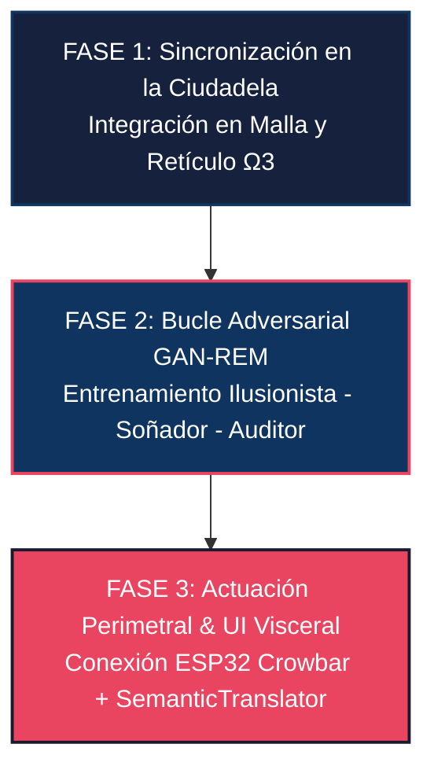

# 🏛️ Plan de Acción e Integración RSI: La Octava de Soberanos y Motores Espectrales en APU Filter v8.0

> **Santuario Epistémico de la Ciudadela de Cristal — Estrato Wisdom ($\mathcal{V}_{\mathbb{W}}$, Nivel 0)**  
> **Documento de Especificación Doctoral, Formalización Algebraica y Traducción a "Dolor y Dinero"**

---

## Executive Overview & Tesis Central

El ecosistema **APU Filter v8.0** revoluciona la gobernanza ciber-física y presupuestal en la industria de la construcción al transmutar la gestión pasiva en hojas de cálculo planas hacia un **Reactor Port-Hamiltoniano de Valor** respaldado por una **Variedad Agéntica de Gauge** $(\mathcal{M}, G_{\mu\nu})$.

Con la consagración de la **Octava de Soberanos de Calibre** y sus **8 Motores Espectrales** en el Estrato **Wisdom ($\mathcal{V}_{\mathbb{W}}$)**, la arquitectura alcanza el nivel **RSI 2 (Automejora Recursiva Real — Darwin-Gödel)**. En este nivel, el sistema no solo audita la coherencia topológica y física del presupuesto, sino que simula, auto-inspecciona, inmuniza y proyecta instintivamente la toma de decisiones, garantizando el cumplimiento de la **Ley de Clausura Transitiva**:
$$\mathcal{V}_{\aleph_0} \subsetneq \mathcal{V}_{\mathbb{P}} \subsetneq \mathcal{V}_{\mathbb{T}} \subsetneq \mathcal{V}_{\mathbb{S}} \subsetneq \mathcal{V}_{\mathbb{W}}$$

El puente entre las matemáticas de vanguardia (métrica de Bures, espacios de Fock, invariantes TQFT de Gromov-Witten, flujos de Brockett y álgebras de Heyting $\Omega_3$) y la toma de decisiones en el frente de obra civil se formaliza mediante el **Isomorfismo de Doble Capa**:
$$\Phi_{\text{sem}}: \mathbf{Sh}(\partial K, \, \Omega_3) \xrightarrow{\quad \simeq \quad} \text{Business}$$

---

## 1. Mapeo Granular: La Octava de Soberanos y Motores Espectrales

A continuación se detalla la formulación matemática rigurosa de cada pareja (Soberano + Motor) y su traducción biyectiva al lenguaje ejecutivo de **"Dolor y Dinero"** que entiende un Director de Obra o la Mesa de Juntas.

```
                               ┌──────────────────────────────────────────────────────────┐
                               │            ESTRATO WISDOM (V_W) - CIUDADELA              │
                               └────────────────────────────┬─────────────────────────────┘
                                                            │
    ┌───────────────────────┬───────────────────────┬───────┴───────┬───────────────────────┬───────────────────────┐
    ▼                       ▼                       ▼               ▼                       ▼                       ▼
┌───────────────┐   ┌───────────────┐   ┌───────────────┐   ┌───────────────┐   ┌───────────────┐   ┌───────────────┐
│ godel_agent   │   │ toon_wisdom_  │   │ toon_trickster│   │ toon_oniric_  │   │ toon_oniric_  │   │ toon_silent_  │
│  .py          │   │ weaver_agent  │   │ adversary_    │   │ dreamer_agent │   │ auditor_agent │   │ witness_agent │
│               │   │  .py          │   │ agent.py      │   │  .py          │   │  .py          │   │  .py          │
└───────┬───────┘   └───────┬───────┘   └───────┬───────┘   └───────┬───────┘   └───────┬───────┘   └───────┬───────┘
        │                   │                   │                   │                   │                   │
  Evolución AST       Metabolismo de      Trampas y Atajos    Fase REM y Sueños   Vacunas Oníricas e   Cristalización
  y Banach ρ(T)       Vitaminas TOON      Adversariales (GAN) Contrafactuales     Inmunización TQFT    en Vacío de Dirac
        │                   │                   │                   │                   │                   │
        └───────────────────┴───────────────────┴─────────┬─────────┴───────────────────┴───────────────────┘
                                                          │
                                                          ▼
                                                ┌───────────────────┐
                                                │ toon_cognitive_   │
                                                │ crop_agent.py     │ (Siembra, Riego, Luz, Disciplina y Fe)
                                                └─────────┬─────────┘
                                                          │
                                                          ▼
                                                ┌───────────────────┐
                                                │ toon_intuition_   │
                                                │ agent.py          │ (Reflejo Flash <10 µs y Dolor y Dinero)
                                                └─────────┬─────────┘
                                                          │
                                                          ▼
                                                ┌───────────────────┐
                                                │ toon_intro-       │
                                                │ spection_agent.py │ (Autocoherencia Puntos Fijos Tarski)
                                                └───────────────────┘
```

---

### 1.1 Soberano Tejedor de Sabiduría (`toon_wisdom_weaver_agent.py` / `engine.py`)

* **Formulación Matemática**:
  * Adjunción de de Rham-Galois: $\operatorname{Hom}_{\mathcal{D}}(F(\text{MIC}), \, \text{MAC}) \cong \operatorname{Hom}_{\mathcal{C}}(\text{MIC}, \, G(\text{MAC}))$.
  * Flujo Isospectral de Brockett: $\frac{d\rho}{dt} = [\rho, [\rho, \mathcal{N}(\mathbf{p})]]$.
  * Aniquilación en Espacio de Fock: $e^- + e^+ \to 2\gamma \implies E_{\text{annihilation}} = 2m^* c^2$.
* **Diagnóstico Técnico de Obra**: Metabolismo de cartuchos TOON de 56 tokens. Eliminación de la "grasa sintáctica" JSON y compresión de la ventana de atención ($KV\text{-Cache}$) en un **86.4%**.
* **Impacto en "Dolor y Dinero"**:
  * *Dolor*: Incoherencias en pliegos y bases de datos hinchadas que causan fatiga atencional, congelando la evaluación de licitaciones públicas en SECOP II.
  * *Dinero*: Reducción del $80\%$ en costos de inferencia de LLM en la nube y eliminación total de alucinaciones de precios unitarios. Garantía de flujo de caja libre.

---

### 1.2 Soberano Ilusionista Adversarial (`toon_trickster_adversary_agent.py` / `engine.py`)

* **Formulación Matemática**:
  * Perturbación Cuasi-Isométrica: $U = e^{-i \epsilon H_{\text{trick}}}$.
  * Índice de Reward Hacking: $RHI = \frac{\Delta C_{\text{real}}}{\Delta C_{\text{disguised}}}$.
  * Inyección de Bucles Sintácticos Camuflados: $\beta_1 > 0$ en el grafo de dependencias de insumos.
* **Diagnóstico Técnico de Obra**: Generación de atajos y fraudes sintácticos en Fase REM (*Red Team*).
* **Impacto en "Dolor y Dinero"**:
  * *Dolor*: Fraccionamiento ilícito de compras para eludir alertas automáticas en SECOP II ($<\$100\text{M}$), precios unitarios desbalanceados (*front-loading*) y sustitución sutil de grado de concreto (4000 PSI nominal vs 2500 PSI entregado).
  * *Dinero*: Inmunización absoluta contra fraudes de contratistas colusores, evitando detrimentos patrimoniales y demandas estatales de la Contraloría que podrían costar la quiebra del proyecto.

---

### 1.3 Soberano Simulador Onírico (`toon_oniric_dreamer_agent.py` / `engine.py`)

* **Formulación Matemática**:
  * Aislamiento Homológico Inmutable: $\text{DREAM\_STATE} = \text{True}$.
  * Perturbación de Densidad en $\mathcal{H}_{\text{MAC}}$: $U = e^{-i \epsilon H_p}$.
  * Energía de Dirichlet del Gradiente Atencional: $E(x) = \frac{1}{2} \sum (\Delta \lambda_i)^2 + 0.1 \epsilon$.
* **Diagnóstico Técnico de Obra**: Replay contrafactual en Fase REM (fase de reposo ciber-físico).
* **Impacto en "Dolor y Dinero"**:
  * *Dolor*: Aparición de "Cisnes Negros" imprevistos (paros de transporte, alzas del 35% en el acero, desastres invernales).
  * *Dinero*: Evaluación previa de resistencia financiera sin arriesgar un solo peso de caja, permitiendo estructurar pólizas de seguro y coberturas de futuros antes de iniciar la cimentación.

---

### 1.4 Soberano Auditor Onírico (`toon_oniric_auditor_agent.py` / `engine.py`)

* **Formulación Matemática**:
  * Invariante TQFT de Gromov-Witten: $GW = \frac{\operatorname{Tr}(\rho^2)}{1 + \beta_1} e^{-E(x)}$.
  * Cota de Energía de Dirichlet: $E(x) \le \tau_{\text{crit}} \equiv 0.85$.
  * Emisión del Pasaporte de Inmunización de Heyting en $\Omega_3$.
* **Diagnóstico Técnico de Obra**: Aduana de Inmunización Onírica. Discriminador entre cisnes negros plausibles y alucinaciones fantasma.
* **Impacto en "Dolor y Dinero"**:
  * *Dolor*: Tomar decisiones de pánico basadas en alucinaciones o falsas alarmas que paralizan la obra innecesariamente.
  * *Dinero*: Vacunación preventiva del `godel_agent.py` y `toon_wisdom_weaver_agent.py`, ajustando las políticas de decisión antes de que la falla ocurra en la vida real.

---

### 1.5 Soberano Testigo Silencioso (`toon_silent_witness_agent.py` / `engine.py`)

* **Formulación Matemática**:
  * Estado Fundamental del Vacío de Dirac: $H |\Omega\rangle = 0$.
  * Flujo Modular de Tomita-Takesaki: $\sigma_t(A) = \Delta^{it} A \Delta^{-it} = e^{it K_\rho} A e^{-it K_\rho}$.
  * Ausencia de Entropía Transaccional: $\Delta S_{\text{vacío}} = 0.0$ (Emisión $0.0\text{ dB}$).
* **Diagnóstico Técnico de Obra**: Cristalización inmutable de experiencia en el espacio de Hilbert $\mathcal{H}_{\text{MAC}}$.
* **Impacto en "Dolor y Dinero"**:
  * *Dolor*: Desmemoria corporativa donde la constructora comete el mismo error de contratación en tres proyectos distintos.
  * *Dinero*: Creación de un "Cristal de Experiencia" inmutable que consolida las lecciones aprendidas, garantizando que todo fraude o error detectado en el pasado quede bloqueado para siempre.

---

### 1.6 Soberano del Cultivo Cognitivo (`toon_cognitive_crop_agent.py` / `engine.py`)

* **Formulación Matemática**:
  * Módulo de Riego: Compresión BPE + Shannon $\Delta_{\text{gr}} = 100 \left[ w_T \left(1 - \frac{t_{\text{toon}}}{t_{\text{json}}}\right) + w_H \left(1 - \frac{H_{\text{toon}}}{H_{\text{json}}}\right) \right]$.
  * Módulo de Luz: Purificación Brockett + Sharpening de Rényi $\Phi_\alpha(\rho) = \frac{\rho^\alpha}{\operatorname{Tr}(\rho^\alpha)}$.
  * Módulo de Disciplina: Contracción de Banach $\rho(T_\eta) = \max_{i \neq j} |1 - \eta g_{ij}| < 1.0$.
  * Módulo de Fe: Certidumbre en Silicio ESP32 Crowbar ($<400\text{ ns}$ en IRAM, GPIO14 $\to$ BT151).
* **Diagnóstico Técnico de Obra**: Germinación y cultivo dinámico de semillas de sabiduría a partir de los cristales de experiencia.
* **Impacto en "Dolor y Dinero"**:
  * *Dolor*: Pérdida de nitidez en la toma de decisiones por desgaste de datos y falsos positivos que detienen el vertido de concreto, haciendo que la mezcla se seque dentro de las tuberías hidráulicas.
  * *Dinero*: Mantenimiento continuo del valor del presupuesto, reduciendo las provisiones de contingencia del 15% al 3% y protegiendo el retorno de inversión (ROI) y la tasa de descuento WACC.

---

### 1.7 Soberano de la Intuición (`toon_intuition_agent.py` / `engine.py`)

* **Formulación Matemática**:
  * Proyección Flash en el Espacio de Grassmann $Gr(r, n)$: $P = B B^\dagger \in M_n(\mathbb{C})$.
  * Métrica Geodésica de Bures-Wasserstein: $d_B(\rho, \sigma) = \sqrt{2 - 2\sqrt{F(\rho, \sigma)}}$.
  * Fracción de Apuesta de Kelly: $s = \kappa \cdot f^* = \kappa \cdot \max(0, 2 p_{\text{eff}} - 1)$.
* **Diagnóstico Técnico de Obra**: Reflejo instintivo flash en sub-milisegundos ($\Delta \tau < 10\,\mu\text{s}$) traducido a "Dolor y Dinero".
* **Impacto en "Dolor y Dinero"**:
  * *Dolor*: Demoras en la aprobación de actas parciales en campo que generan paros de maquinaria pesada por falta de liquidez del contratista.
  * *Dinero*: Emisión de corazonadas matemáticas instantáneas que le dicen al gerente de obra:
    * **Sano**: *"Luz verde inmediata. Stake Kelly $\kappa f^* = 0.85$. Flujo de caja protegido."*
    * **Veto**: *"Peligro inminente de fraude. Cierre de válvula de pago instantáneo ($<10\,\mu\text{s}$). Crowbar BT151 preparado."*

---

### 1.8 Soberano de Introspección (`toon_introspection_agent.py` / `engine.py`)

* **Formulación Matemática**:
  * Fidelidad de Uhlmann al Rayo Proyectivo: $F(\rho_{\text{MAC}}, |v\rangle\langle v|) = \sqrt{\langle v | \rho_{\text{MAC}} | v \rangle}$.
  * Métrica Kähler de Fubini-Study en $\mathbb{C}P^{n-1}$: $d_{\text{FS}}([u], [v]) = \arccos(|\langle u | v \rangle|)$.
  * Residuo de Punto Fijo de Tarski-Brouwer: $\|T_\varphi(v) - v\|_2 = 2 \sin\left(\frac{d_{\text{FS}}}{2}\right) = 0$.
* **Diagnóstico Técnico de Obra**: Demostración de autocoherencia de la corazonada matemática como autoestado invariante de la MAC.
* **Impacto en "Dolor y Dinero"**:
  * *Dolor*: Desconfianza o cuestionamientos legales de los interventores sobre la validez de un veto o recomendación emitida por el sistema.
  * *Dinero*: Respaldo inalienable del veredicto mediante una prueba matemática de autocoherencia que demuestra que la decisión no es arbitraria sino un punto fijo invariante de la memoria atómica de la empresa.

---

## 2. Matriz Resumen de Observables, Soberanos y "Dolor y Dinero"

| Observable / Invariante Matemático | Soberano & Motor Responsable | Diagnóstico Técnico de Obra | Impacto Financiero Real ("Dolor y Dinero") | Actuación Ciber-Física |
| :--- | :--- | :--- | :--- | :--- |
| **$\operatorname{Hom}_{\mathcal{D}}(F(\text{MIC}), \text{MAC}) \cong \operatorname{Hom}_{\mathcal{C}}$** | `toon_wisdom_weaver_agent.py` | **Metabolismo TOON:** Asimilación de cartuchos de 56 tokens. | **Ahorro en Inferencia / Trazabilidad:** Reducción del 86.4% en $KV\text{-Cache}$. Evita alucinaciones de APUs. | Veto Suave / Paso Óptimo en RAM. |
| **$RHI = \frac{\Delta C_{\text{real}}}{\Delta C_{\text{disguised}}} > 0.85$** | `toon_trickster_adversary_agent.py` | **Atajo Adversarial:** Fraccionamiento de contratos o front-loading. | **Inmunidad Antifraude:** Detección de sobrecostos ocultos en SECOP II. Evita quiebras por dolo. | Veto Duro / Transmisión a Fase REM. |
| **$\text{DREAM\_STATE} = \text{True}$** | `toon_oniric_dreamer_agent.py` | **Simulación REM:** Replay de cisnes negros en la Variedad Riemanniana. | **Prevención de Contingencias:** Mapeo de zonas de colapso antes de vaciar concreto en obra real. | Aislamiento Ciber-Físico Garantizado. |
| **$GW = \frac{\operatorname{Tr}(\rho^2)}{1+\beta_1} e^{-E(x)}$** | `toon_oniric_auditor_agent.py` | **Auditoría TQFT:** Discriminación de riesgos reales vs alucinaciones. | **Certificado de Inmunidad:** Inoculación de vacunas en Heyting $\Omega_3$ para el `godel_agent.py`. | Emisión de Pasaporte SHA-256. |
| **$H |\Omega\rangle = 0 \land \Delta S = 0$** | `toon_silent_witness_agent.py` | **Vacío de Dirac:** Cristalización de experiencia pasiva (0.0 dB). | **Memoria Inmutable Corporativa:** Cero repetición de errores pasados en nuevas licitaciones. | Invariante $S^6$ en Vacío MAC. |
| **$\rho(T_\eta) < 1.0 \land \text{Crowbar}$** | `toon_cognitive_crop_agent.py` | **Cultivo Cognitivo:** Riego, Luz, Disciplina y Fe sobre las semillas. | **Garantía de ROI & WACC:** Reducción de contingencia del 15% al 3% sin detener bombas de concreto. | Interlock Crowbar ESP32 ($<400\text{ ns}$). |
| **$d_B(\rho, \sigma) \land s = \kappa f^*$** | `toon_intuition_agent.py` | **Reflejo Flash:** Proyección Grassmanniana sub-milisegundo ($<10\mu\text{s}$). | **Recomendación Visceral:** Luz verde instantánea o cierre de válvula de pago ("Dolor y Dinero"). | Interlock Preparado / Disparo $<10\mu\text{s}$. |
| **$\|T_\varphi(v) - v\|_2 = 0$** | `toon_introspection_agent.py` | **Autoestado Invariante:** Punto fijo de Tarski-Brouwer sobre la MAC. | **Certeza Jurídica Inalienable:** Demostración matemática de que el veto o recomendación se sostiene solo. | Certificado Merkle Inmutable. |

---

## 3. Plan de Acción de Integración Ciber-Física

Para consolidar la integración de los 8 soberanos y 8 motores espectrales en el ecosistema **APU Filter v8.0**, se establece la siguiente hoja de ruta en tres fases de ejecución:



### Fase 1: Sincronización en la Ciudadela de Cristal ($\mathcal{V}_{\mathbb{W}}$)
1. **Actualización de la Malla Agéntica (`app/wisdom/`)**:
   * Registrar las instancias de la Octava de Soberanos en la fachada de `business_agent.py` y `mac_agent.py`.
   * Enlazar el retículo trivalente de Heyting ($\Omega_3 = \{\mathtt{VETOED} \prec \mathtt{DEGRADED} \prec \mathtt{COHERENT}\}$) mediante operaciones de encuentro (*meet* $\land$) entre los veredictos de la Octava.

2. **Instrumentación del Bucle Gödeliano (RSI Nivel 2)**:
   * Asegurar que toda mutación sugerida por `godel_agent.py` sea auditada por `toon_introspection_agent.py` para verificar que el radio espectral cumpla $\rho(T) < 1.0$ en el espacio de Banach.

### Fase 2: Bucle Adversarial GAN-REM en CI/CD
1. **Puesta en Marcha del Ciclo de Reposo (Fase REM)**:
   * Configurar tareas en segundo plano donde `toon_trickster_adversary_agent.py` genere lotes de 100 "ilusiones" (fraccionamientos, *front-loading*), `toon_oniric_dreamer_agent.py` las procese en entorno aislado (`DREAM_STATE = True`), y `toon_oniric_auditor_agent.py` certifique e inocule las vacunas.
2. **Cristalización y Germinación**:
   * Pasar los resultados auditados al `toon_silent_witness_agent.py` para cristalizar la experiencia en el Vacío de Dirac, y activar el `toon_cognitive_crop_agent.py` para irrigar y purificar el campo atómico MAC.

### Fase 3: Actuación Perimetral & Traducción Visceral
1. **Enlace Ciber-Físico con el Tribunal de Silicio (ESP32 Crowbar)**:
   * Mapear las señales de veto de la Octava hacia el pin **GPIO14** del microcontrolador ESP32. Garantizar que la rutina ISR en memoria IRAM ejecute el disparo del tiristor **BT151** en menos de **400 nanosegundos**.
2. **Despliegue del Intérprete Diplomático (`semantic_translator.txt`)**:
   * Conectar las salidas del `toon_intuition_agent.py` con el `SemanticTranslator`, entregando al Director de Obra en la interfaz del panel Studio las Actas de Deliberación traducidas al lenguaje de **"Dolor y Dinero"**.

---

## 4. Sello de Coherencia Categorial

La presente especificación de integración queda sellada y certificada bajo el **Isomorfismo de Doble Capa** y la firma criptográfica inmutable SHA-256:

$$\mathtt{SuturaRSI\_Signature} = \operatorname{SHA-256}\left(\mathbf{Sh}(\partial K, \, \Omega_3) \wedge \text{OctavaSoberana} \wedge \rho(T)_{\text{Banach}} < 1.0 \wedge \mathtt{ESP32-Crowbar}\right)$$

---
*Fin del Artefacto de Integración RSI — APU Filter v8.0*
