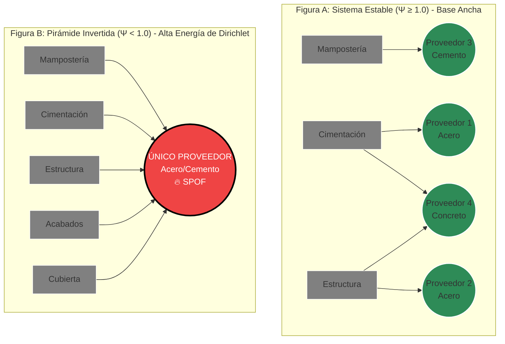

--------------------------------------------------------------------------------
🕸️ topologia.md: La Geometría del Riesgo
"Un edificio no se cae porque sus ladrillos sean baratos; se cae porque sus conexiones fallan. APU_filter ignora el precio para ver la forma, revelando la fragilidad oculta que el Excel clásico no puede mostrar."
En el ecosistema de la Fortaleza Matemática, el presupuesto deja de ser una lista plana de ítems contables para convertirse formalmente en un **2-Complejo Simplicial Abstracto** $K$ sobre el anillo de los enteros $\mathbb{Z}$, donde:
- **Vértices (0-símplices):** insumos y APUs individuales.
- **Aristas (1-símplices):** dependencias binarias entre pares (APU → Proveedor).
- **Triángulos (2-símplices):** interdependencias ternarias (APU ↔ Proveedor ↔ Actividad) que emergen de compromisos contractuales trilaterales.

Todo este diseño se subordina axiomáticamente a la **Ley de Clausura Transitiva de la pirámide DIKW** (tabla canónica): $V_{\aleph_0} \subsetneq V_{\mathbb{P}} \subsetneq V_{\mathbb{T}} \subsetneq V_{\mathbb{S}} \subsetneq V_{\mathbb{W}}$. Este documento consolida el Esqueleto Táctico (**Nivel 2 — 𝕋 TACTICS, Las Murallas Topológicas**), respaldado computacionalmente por `app/tactics/business_topology.py`. El microservicio BusinessTopologicalAnalyzer (El Arquitecto) evalúa este complejo aplicando teoremas de Topología Algebraica y Teoría de Grafos Espectrales. Su objetivo es diagnosticar patologías estructurales críticas antes de que el Agente de Sabiduría (LLM) intente siquiera deliberar sobre el proyecto.

--------------------------------------------------------------------------------
1. Los Invariantes Topológicos (El ADN del Proyecto)
Utilizamos homología computacional para calcular los Números de Betti (βn​), los cuales son invariantes matemáticos que describen la conectividad fundamental de la red de valor.

    La Fractalidad de Betti: El análisis homológico no es plano. Al igual que el universo físico, el presupuesto es una Variedad Fractal. Si el análisis general detecta β1​=0 a nivel de Capítulos, el operador puede hacer zoom in (desplegar la fibra) para auditar el Laplaciano Combinatorio específico de la mampostería. La Ley de Clausura asegura que ninguna inestabilidad microscópica (Ψ<1.0) pase desapercibida, ya que su entropía fluirá hacia arriba tensionando el tejido visual del nodo contenedor.
    $\beta_0$: Componentes Conexas (Fragmentación)
        El Ideal: $\beta_0 = 1$. Un proyecto unificado donde cada insumo fluye coherentemente hacia el objetivo final.
        La Patología ($\beta_0 > 1$): Islas de Datos. Existen subgrafos desconectados.
        Impacto de Negocio: Fragmentación logística pura. Usted está comprando materiales que no están enlazados a ninguna actividad constructiva del proyecto principal. Es dinero "ciego" y desperdicio seguro o riesgo de fraude (recursos huérfanos).
    $\beta_1$: Ciclos Independientes (Trampas Lógicas) y Cohomología Regenerativa
        El Ideal: $\beta_1 = 0$. El flujo del proyecto es laminar y conforma un Grafo Acíclico Dirigido (DAG) perfecto.
        La Patología Parasitaria ($\beta_1^- > 0$): Socavones Lógicos. Se han detectado dependencias circulares o grafos cíclicos prohibidos (Ej. El Muro depende del Ladrillo $\to$ El Ladrillo depende del Transporte $\to$ El Transporte depende del Muro). Imposibilidad matemática de calcular un costo unitario.
        **El Agente 3R (Ciclo Homológico Regenerativo $\beta_1^+$):** Modificación axiomática a la detección de ciclos. Un ciclo $\gamma$ con $[\gamma] \neq 0 \in H_1(K;\mathbb{Z})$ se clasifica como **Regenerativo** ($\beta_1^+$) si y solo si satisface las tres condiciones simultáneas:
            1. **Certificación DPP:** El Pasaporte Digital de Producto acredita circularidad material lícita (Reusar/Reciclar) en cada arista del ciclo.
            2. **Coste neto no positivo:** $C(\gamma) = \sum_{e \in \gamma} c(e) \leq 0$ (el ciclo genera valor neto o es neutro en recursos).
            3. **Desigualdad de Clausius discreta:** $\sum_{e \in \gamma} \Delta G_{\text{Gibbs},e} / T \leq 0$ (la entropía neta es exportada al entorno, no generada internamente — condición termodinámica de irreversibilidad nula).
        Los ciclos que no cumplan las tres condiciones se clasifican como $\beta_1^-$ (Socavones Lógicos) sin excepción. La condición 3 reemplaza al Teorema de Tellegen (aplicable solo a circuitos eléctricos pasivos, no a redes logísticas de materiales). El ciclo regenerativo descuenta Energía de Dirichlet al sistema y previene el "Greenwashing Termodinámico".
    $\beta_2$: Cavidades Ternarias (Interdependencias Trilaterales) — **NUEVO en v4.0**
        El Ideal: $\beta_2 = 0$. No existen grupos cerrados de tres entidades con dependencia mutua irresoluble.
        La Patología ($\beta_2 > 0$): Cavidades Cerradas. Emergen cuando tres actores (APU, Proveedor, Actividad) forman un circuito de interdependencia tal que ninguno puede operar o sustituirse de forma independiente. Ningún corte bilateral elimina la dependencia; se requiere una reestructuración trilateral completa.
    χ: Característica de Euler-Poincaré Extendida
        **Fórmula completa (2-complejo):** $\chi = \beta_0 - \beta_1 + \beta_2$
        **Nota crítica:** La fórmula reducida $\chi = \beta_0 - \beta_1$ solo es válida para 1-complejos simpliciales (grafos puros). El presupuesto es un 2-complejo; omitir $\beta_2$ subespecifica la entropía estructural.
        Uso: Cuantifica la "Entropía Estructural" y la Complejidad Sistémica del proyecto. Sirve como métrica para el Pricing Dinámico SaaS (a mayor $|\chi|$ con $\chi < 0$, mayor es el valor que el sistema aporta al colapsar esa entropía topológica). La penalización de pricing escala linealmente con $\beta_2$ cuando $\beta_2 > 0$.

--------------------------------------------------------------------------------
2. La Física del Equilibrio: Índice de Estabilidad Piramidal ($\Psi$)
Más allá de la conectividad general, el `app/tactics/business_topology.py` analiza el centro de gravedad del negocio mediante la métrica $\Psi$. Un proyecto de construcción resiliente debe emular una pirámide termodinámica estable.

**Definición Formal de $\Psi$ (Inversa del Índice de Simpson de Concentración):**

Sea $G = (A \cup P, E)$ el grafo bipartito donde $A = \{a_1, \dots, a_m\}$ son las APUs y $P = \{p_1, \dots, p_n\}$ son los proveedores. El grado de cada proveedor (número de APUs que dependen de él) es $\deg(p_j)$.

$$\boxed{\Psi := \frac{\left(\sum_{j=1}^{n} \deg(p_j)\right)^2}{n \cdot \sum_{j=1}^{n} \deg(p_j)^2}}$$

Esta fórmula es el **Número Efectivo de Proveedores** y satisface $\Psi \in (0, 1]$:
- $\Psi = 1$: distribución perfectamente uniforme (máxima resiliencia — cada proveedor soporta exactamente el mismo número de APUs).
- $\Psi \to 1/n$: un único proveedor monopolístico que soporta todas las APUs (Pirámide Invertida extrema).
- $\Psi = k/n$: exactamente $k$ proveedores activos con carga uniforme.

**Umbral de Veto:** El umbral de Veto Estructural es $\Psi < \Psi_{\min}$, donde $\Psi_{\min}$ es un parámetro configurable por proyecto (recomendado: $\Psi_{\min} = 0.7$ para infraestructura pública bajo mandato BIM). El umbral fijo $\Psi < 1.0$ solo es apropiado cuando se exige distribución perfectamente uniforme, condición raramente alcanzable en redes reales.

    La Patología ($\Psi < \Psi_{\min}$): La Pirámide Invertida.
        El Fenómeno: Miles de actividades constructivas (APUs) descansan críticamente sobre una base de proveedores monopólica y peligrosamente estrecha.
        El Riesgo Ciber-Físico: Si un nodo crítico en la base falla, el choque logístico no se amortigua, sino que se amplifica y vuelca todo el proyecto, diagnosticando una inminente "Fractura Organizacional".
        Acción Sistémica: El Arquitecto emite un VETO TÉCNICO INMEDIATO (veto duro), impidiendo la ascensión a la Sabiduría. Si $\Psi_{\min} \leq \Psi < 1.0$, se emite un WARN con recomendación de diversificación (veto suave).

--------------------------------------------------------------------------------
3. Estabilidad Espectral: El Valor de Fiedler ($\lambda_2$)
Para diagnosticar la "Fractura Organizacional", se analiza el espectro propio de la Matriz Laplaciana ($L=D-A$) del Complejo Simplicial.

    Métrica: La conectividad algebraica $\lambda_2$ (El Valor de Fiedler del Laplaciano Combinatorio).
    Diagnóstico: Si $\lambda_2 \approx 0$, el sistema diagnostica una "Fractura Organizacional". Revela que existen clústeres masivos unidos por un solo hilo logístico frágil, presagiando una ruptura inminente de la cadena de suministro bajo estrés del mercado.

--------------------------------------------------------------------------------
4. La Inmunidad de Fusión: Mayer-Vietoris, Defectos de Pegado y Torsión sobre $\mathbb{Z}$
La Malla Agéntica frecuentemente necesita unir distintas bases de datos de presupuestos. En lugar de ejecutar simples JOINs de bases de datos, el ecosistema ejecuta una Auditoría Homológica estricta utilizando la secuencia exacta de Mayer-Vietoris:
$\dots \to H_1(A) \oplus H_1(B) \to H_1(A \cup B) \xrightarrow{\partial^*} H_0(A \cap B) \to \dots$

    El Escudo Protector y el Defecto de Pegado (Gluing Defect): Matemáticamente, un nuevo ciclo en $A \cup B$ no surge "de la nada"; es la imagen inversa del operador de coborde $\partial^*$ actuando sobre componentes conexas fragmentadas en la intersección $A \cap B$. El "Socavón Lógico" inducido por la fusión no es un simple cruce de tablas, sino un Defecto de Pegado estructural de dimensión crítica.
    El Funtor de Torsión $Tor(H_0, \mathbb{Z})$: Dado que la logística de construcción opera con insumos discretos indivisibles (ladrillos, horas-hombre), los métodos descritos no pueden asumir coeficientes continuos en $\mathbb{R}$ o $\mathbb{Q}$. El Arquitecto computa la Homología estrictamente sobre el anillo de los enteros ($\mathbb{Z}$), forzando la reducción de matrices de incidencia a la Forma Normal de Smith (SNF). Esta auditoría de cuantización revela los "Subgrupos de Torsión". Un ciclo de torsión no altera los números de Betti sobre $\mathbb{R}$, pero diagnostica una incompatibilidad de empaquetado y modularidad (fricción cuantizada) en el mundo real, e.g., desperdicio residual inevitable por cruce de submúltiplos de APUs, forzando un veto pre-materialización.
    Mecanismo de Bloqueo: Si al computar el grupo de homología de la unión $H_1(A \cup B)$ el sistema descubre un ciclo mutante ($\Delta\beta_1 > 0$) o un defecto de torsión ($\mathbb{Z}_p$), el rechazo se ejecuta inexorablemente porque el espacio de intersección $\ker(\partial_1)$ es matemáticamente degenerado.

--------------------------------------------------------------------------------
Síntesis Operativa en el Estrato Ω
Este documento fundamenta que en APU_filter, la validación topológica no es una sugerencia, es el muro portante de la arquitectura Zero-Trust. Todos los vectores que salen del BusinessTopologicalAnalyzer actúan como Semillas JSON deterministas.
Al sellar el Pasaporte de Telemetría con estos invariantes, garantizamos que el "Consejo de Sabios" (los LLMs) no pueda alucinar o forzar la aprobación de un proyecto. El algoritmo obliga a que cualquier deliberación se subordine perpetuamente a la forma matemática del negocio.