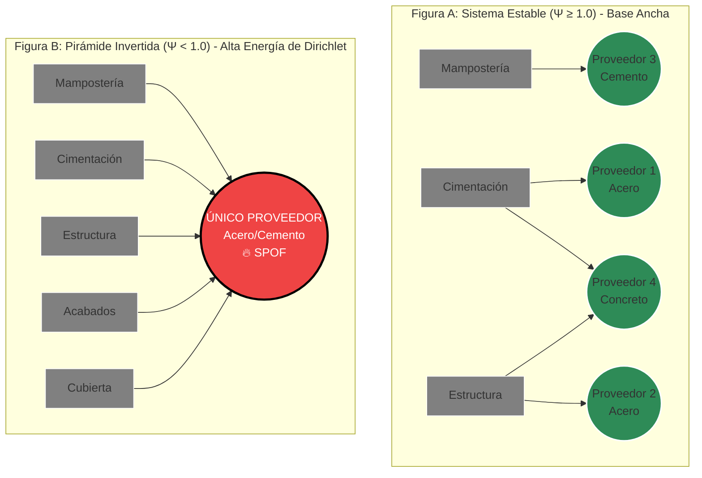

--------------------------------------------------------------------------------
🕸️ topologia.md: La Geometría del Riesgo
"Un edificio no se cae porque sus ladrillos sean baratos; se cae porque sus conexiones fallan. APU_filter ignora el precio para ver la forma, revelando la fragilidad oculta que el Excel clásico no puede mostrar."
En el ecosistema de la Fortaleza Matemática, el presupuesto deja de ser una lista plana de ítems contables para convertirse formalmente en un Complejo Simplicial Abstracto $K$. Todo este diseño se subordina axiomáticamente a la **Ley de Clausura Transitiva de la pirámide DIKW**: $V_{PHYSICS} \subset V_{TACTICS} \subset V_{STRATEGY} \subset V_{WISDOM}$. Este documento consolida el Esqueleto Táctico (Estrato TACTICS - Nivel 2), respaldado computacionalmente por `app/tactics/business_topology.py`. El microservicio BusinessTopologicalAnalyzer (El Arquitecto) evalúa este complejo aplicando teoremas de Topología Algebraica y Teoría de Grafos Espectrales. Su objetivo es diagnosticar patologías estructurales críticas antes de que el Agente de Sabiduría (LLM) intente siquiera deliberar sobre el proyecto.

--------------------------------------------------------------------------------
1. Los Invariantes Topológicos (El ADN del Proyecto)
Utilizamos homología computacional para calcular los Números de Betti (βn​), los cuales son invariantes matemáticos que describen la conectividad fundamental de la red de valor.

    La Fractalidad de Betti: El análisis homológico no es plano. Al igual que el universo físico, el presupuesto es una Variedad Fractal. Si el análisis general detecta β1​=0 a nivel de Capítulos, el operador puede hacer zoom in (desplegar la fibra) para auditar el Laplaciano Combinatorio específico de la mampostería. La Ley de Clausura asegura que ninguna inestabilidad microscópica (Ψ<1.0) pase desapercibida, ya que su entropía fluirá hacia arriba tensionando el tejido visual del nodo contenedor.
    $\beta_0$: Componentes Conexas (Fragmentación)
        El Ideal: $\beta_0 = 1$. Un proyecto unificado donde cada insumo fluye coherentemente hacia el objetivo final.
        La Patología ($\beta_0 > 1$): Islas de Datos. Existen subgrafos desconectados.
        Impacto de Negocio: Fragmentación logística pura. Usted está comprando materiales que no están enlazados a ninguna actividad constructiva del proyecto principal. Es dinero "ciego" y desperdicio seguro o riesgo de fraude (recursos huérfanos).
    $\beta_1$: Ciclos Independientes (Trampas Lógicas)
        El Ideal: $\beta_1 = 0$. El flujo del proyecto es laminar y conforma un Grafo Acíclico Dirigido (DAG) perfecto.
        La Patología ($\beta_1 > 0$): Socavones Lógicos. Se han detectado dependencias circulares o grafos cíclicos prohibidos (Ej. El Muro depende del Ladrillo $\to$ El Ladrillo depende del Transporte $\to$ El Transporte depende del Muro).
        Impacto de Negocio: Imposibilidad matemática de calcular un costo unitario real. Esto dispara una Mónada de Error (F(0)=0) y el Gatekeeper del sistema bloquea inmediatamente cualquier cálculo financiero posterior.
    χ: Característica de Euler-Poincaré
        Fórmula: χ=β0​−β1​.
        Uso: Cuantifica la "Entropía Estructural" y la Complejidad Sistémica del proyecto. Sirve como métrica base para el Pricing Dinámico del modelo de negocio SaaS (a mayor complejidad y entropía topológica, mayor es el valor que el sistema aporta al colapsar dicho riesgo).

--------------------------------------------------------------------------------
2. La Física del Equilibrio: Índice de Estabilidad Piramidal ($\Psi$)
Más allá de la conectividad general, el `app/tactics/business_topology.py` analiza el centro de gravedad del negocio mediante la métrica $\Psi$. Un proyecto de construcción resiliente debe emular una pirámide termodinámica estable.

    La Patología ($\Psi < 1.0$): La Pirámide Invertida.
        El Fenómeno: Miles de actividades constructivas (APUs) descansan críticamente sobre una base de proveedores monopólica y peligrosamente estrecha.
        El Riesgo Ciber-Físico: Si un nodo crítico en la base falla, el choque logístico no se amortigua, sino que se amplifica y vuelca todo el proyecto, diagnosticando una inminente "Fractura Organizacional".
        Acción Sistémica: El Arquitecto emite un VETO TÉCNICO INMEDIATO, impidiendo la ascensión a la Sabiduría.

--------------------------------------------------------------------------------
3. Estabilidad Espectral: El Valor de Fiedler ($\lambda_2$)
Para diagnosticar la "Fractura Organizacional", se analiza el espectro propio de la Matriz Laplaciana ($L=D-A$) del Complejo Simplicial.

    Métrica: La conectividad algebraica $\lambda_2$ (El Valor de Fiedler del Laplaciano Combinatorio).
    Diagnóstico: Si $\lambda_2 \approx 0$, el sistema diagnostica una "Fractura Organizacional". Revela que existen clústeres masivos unidos por un solo hilo logístico frágil, presagiando una ruptura inminente de la cadena de suministro bajo estrés del mercado.

--------------------------------------------------------------------------------
4. La Inmunidad de Fusión: Mayer-Vietoris, Defectos de Pegado y Torsión sobre $\mathbb{Z}$
La Malla Agéntica frecuentemente necesita unir distintas bases de datos de presupuestos. En lugar de ejecutar simples JOINs de bases de datos, el ecosistema ejecuta una Auditoría Homológica estricta utilizando la secuencia exacta de Mayer-Vietoris:
$\dots \to H_1(A) \oplus H_1(B) \to H_1(A \cup B) \xrightarrow{\partial^*} H_0(A \cap B) \to \dots$

    El Escudo Protector y el Defecto de Pegado (Gluing Defect): Matemáticamente, un nuevo ciclo en $A \cup B$ no surge "de la nada"; es la imagen inversa del operador de coborde $\partial^*$ actuando sobre componentes conexas fragmentadas en la intersección $A \cap B$. El "Socavón Lógico" inducido por la fusión no es un simple cruce de tablas, sino un Defecto de Pegado estructural de dimensión crítica.
    El Funtor de Torsión $Tor(H_0, \mathbb{Z})$: Dado que la logística de construcción opera con insumos discretos indivisibles (ladrillos, horas-hombre), los métodos descritos no pueden asumir coeficientes continuos en $\mathbb{R}$ o $\mathbb{Q}$. El Arquitecto computa la Homología estrictamente sobre el anillo de los enteros ($\mathbb{Z}$), forzando la reducción de matrices de incidencia a la Forma Normal de Smith (SNF). Esta auditoría de cuantización revela los "Subgrupos de Torsión". Un ciclo de torsión no altera los números de Betti sobre $\mathbb{R}$, pero diagnostica una incompatibilidad de empaquetado y modularidad (fricción cuantizada) en el mundo real, e.g., desperdicio residual inevitable por cruce de submúltiplos de APUs, forzando un veto pre-materialización.
    Mecanismo de Bloqueo: Si al computar el grupo de homología de la unión $H_1(A \cup B)$ el sistema descubre un ciclo mutante ($\Delta\beta_1 > 0$) o un defecto de torsión ($\mathbb{Z}_p$), el rechazo se ejecuta inexorablemente porque el espacio de intersección $\ker(\partial_1)$ es matemáticamente degenerado.

--------------------------------------------------------------------------------
Síntesis Operativa en el Estrato Ω
Este documento fundamenta que en APU_filter, la validación topológica no es una sugerencia, es el muro portante de la arquitectura Zero-Trust. Todos los vectores que salen del BusinessTopologicalAnalyzer actúan como Semillas JSON deterministas.
Al sellar el Pasaporte de Telemetría con estos invariantes, garantizamos que el "Consejo de Sabios" (los LLMs) no pueda alucinar o forzar la aprobación de un proyecto. El algoritmo obliga a que cualquier deliberación se subordine perpetuamente a la forma matemática del negocio.