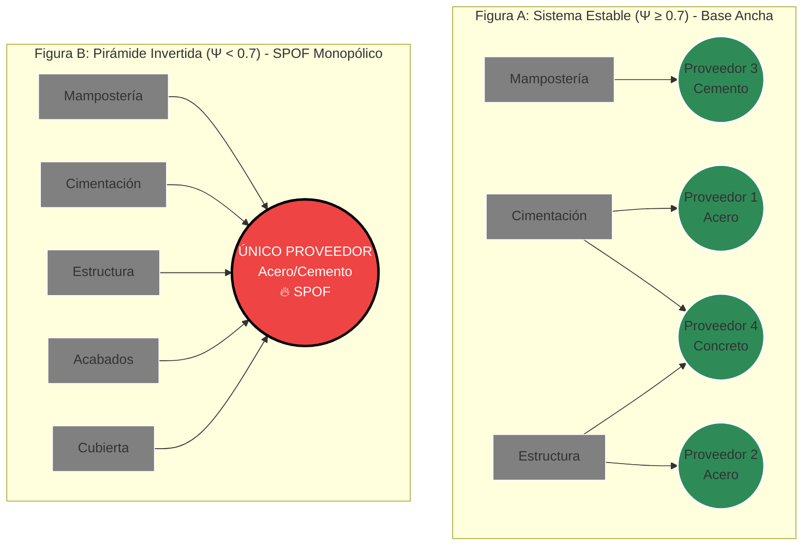

--------------------------------------------------------------------------------
🕸️ topologia.md: La Geometría del Riesgo y la Topología de la Variedad
"Un edificio no se cae porque sus ladrillos sean baratos; se cae porque sus conexiones fallan. APU_filter ignora el precio para ver la forma, revelando la fragilidad oculta que el Excel clásico no puede mostrar."
--------------------------------------------------------------------------------

En el ecosistema de la Fortaleza Matemática de **APU Filter v8.0**, el presupuesto de obra deja de ser un listado plano de ítems contables para convertirse formalmente en un **2-Complejo Simplicial Abstracto** $K$ sobre el anillo de los enteros $\mathbb{Z}$, donde:
- **Vértices (0-símplices):** insumos atómicos y APUs individuales.
- **Aristas (1-símplices):** dependencias binarias entre pares (APU $\to$ Proveedor / Insumo).
- **Triángulos (2-símplices):** interdependencias ternarias (APU $\leftrightarrow$ Proveedor $\leftrightarrow$ Actividad) que emergen de compromisos contractuales trilaterales.

Todo este diseño se subordina axiomáticamente a la **Ley de Clausura Transitiva de la pirámide DIKW** (tabla canónica): $V_{\aleph_0} \subsetneq V_{\mathbb{P}} \subsetneq V_{\mathbb{T}} \subsetneq V_{\mathbb{S}} \subsetneq V_{\mathbb{W}}$. Este documento consolida el Esqueleto Táctico (**Nivel 2 — 𝕋 TACTICS, Las Murallas Topológicas**), respaldado computacionalmente por `app/tactics/business_topology.py` y auditado por `TopologicalControlSurfaceAgent`, `BoundaryRingSheafAgent` y el Soberano de Cirugía de Čech **`TopologicalSurgeryCechAgent`** [topological_surgery_cech_agent.py, Isomorfismo_Doble_Capa.md].

---

El **Funtor de Traducción Semántica $\Phi$** establece un homeomorfismo semántico functorial biyectivo entre el clasificador de subobjetos del topos de de Rham-Čech-Heyting y la dimensión ejecutiva de negocios de la constructora:

$$\Phi: \mathbf{Sh}(\partial K, \, \Omega_3) \xrightarrow{\quad \simeq \quad} \text{Business}$$

Este funtor proyecta homeomórficamente los residuos espectrales de de Rham a métricas claras de **"Dolor y Dinero"** que entiende un gerente de obra humano:
| Nivel I: La Base (Invariantes Puros en FPU) | Nivel II: El Estrato Medio (Auditoría Técnica) | Nivel III: La Cúspide (Dolor y Dinero Ejecutivos) | Mitigación y Acción Ciber-Física en Obra |
| :--- | :--- | :--- | :--- |
| **$\beta_0 > 1 \ \implies \ \dim H^0(K; \, \mathbb{Z}) > 1$**<br>El núcleo del operador cofrontera discreto posee componentes disconexas flotando en el vacío. | **Islas de Datos / Recursos Huérfanos**<br>Mapea insumos presupuestales o adiciones paralelas sin trazabilidad en el grafo de APUs. | **Duplicación de Cobros y Fugas de Capital**<br>Contratistas cobrando dos veces el mismo flete o cemento, vulnerando la responsabilidad fiscal del representante legal ante demandas estatales. | **VETO DURO INSTANTÁNEO:** El Guardián bloquea síncronamente el cargue de pliegos en SECOP II en el milisegundo cero. |
| **$\beta_1 > 0 \ \implies \ \dim H^1(K; \, \mathbb{Z}) > 0$**<br>Surgimiento de ciclos independientes no nulos en el primer grupo de homología simplicial. | **Socavones Lógicos**<br>Dependencias circulares ilegales de precios en los Análisis de Precios Unitarios (APUs) (el insumo A depende del flete de B, y el flete de B depende de A). | **Bucle de Sobrecosto y Parálisis por Bloqueo**<br>Divisiones por cero en el solver de la FPU que congelan la aprobación de la licitación pública y delatan triangulación financiera de subcontratistas. | **VETO DURO INSTANTÁNEO:** Bloqueo de la transacción en RAM. La aduana detiene de facto el avance de la licitación antes de inyectar entropía en la caja. |
| **$\Psi = \frac{N_{\mathrm{insumos}}}{N_{\mathrm{apus}}} \cdot \frac{1}{\rho} < \Psi_{\mathrm{min}} \equiv 0.70$**<br>El segundo menor autovalor del Laplaciano normalizado ($\lambda_2$) de la red decae críticamente. | **Pirámide Invertida (Fragilidad de Cheeger)**<br>Concentración crítica y monopólica de un único proveedor clave de cemento o acero para 50 frentes de obra. | **Riesgo de Quiebra por Desabastecimiento**<br>Un paro o disrupción del proveedor único paraliza síncronamente el megaproyecto civil, gatillando multas millonarias por mora e incrementando el WACC. | **VETO SUAVE (Luz Ámbar):** Baliza visual en obra y temporizador de gracia de 1 hora. Prescribe de forma determinista la diversificación de Socios Clave en el BMC. |
| **$\check{H}^1(\mathcal{U}; \, \mathcal{F}) \neq \mathbf{0}$**<br>La primera obstrucción cohomológica de Čech en la aduana local de transductores es no nula. | **Paradoja Contractual / Veto de Coherencia**<br>Incongruencias insalvables introducidas por la IA estocástica o por el desajuste de datos crudos (Excels rotos con celdas combinadas). | **Invalidez de Licitación y Mermas de Contexto**<br>Incoherencias en los pliegos que inducen fatiga atencional y alucinaciones por saturación del $KV\text{-Cache}$ del LLM en el borde. | **VETO DURO INSTANTÁNEO:** Veto absoluto. Anulación del pasaporte de telemetría y congelamiento de la sesión en RAM. |
| **$\operatorname{Tor}\left(H_k(K; \, \mathbb{Z})\right) \neq \mathbf{0} \implies \exists d_i > 1$**<br>La reducción de Smith Normal Form sobre $\mathbb{Z}$ delata factores invariantes de torsión no unitarios. | **Ruptura de Simetría / Torsión sobre $\mathbb{Z}$**<br>Presencia de divisores de torsión que denotan desequilibrios o inconsistencias en los bucles de recursos cerrados. | **Sobrecostos Ocultos y Triangulación**<br>Mapea de forma forense el desvío ilícito de materiales o cobros indirectos de contratistas duplicados ante el SECOP II. | **VETO DURO INSTANTÁNEO:** Veto ineludible. La ISR en IRAM paraliza de inmediato mezcladoras de obra en seco en menos de 400 ns. |
| **$\|[a, b, c]\|_{\mathbb{O}} > \tau_{\mathrm{asoc}} \equiv 0.15$**<br>La norma del tensor asociador octoniónico excede el techo elástico de la no-asociatividad. | **Frustración de Calibre / Tríada de-normalizada**<br>La composición secuencial Contractor-Supplier-Interventor rompe la simetría de lazo debido a sobrecostos imprevistos. | **Triangulación y Colusión Multilateral**<br>Interacciones no lineales de precios que desvían capital y delatan acuerdos monopolísticos bajo la mesa antes del vertido. | **VETO SUAVE (Luz Ámbar):** Cuenta atrás de 1 hora de gracia. Disipable por aniquilación de Fock mediante override signed HMAC. |
| **$\|\mathbf{A}_5(P_1, \dots, P_5)\|_{\mathbb{P}} > \tau_5 \equiv 5.0$**<br>La norma del asociador pentagonal pationiónico 32D excede la tolerancia elástica de 5 vías. | **Frustración Pentagonal / Cartelización 5-Vías**<br>Dependencias cruzadas no asociativas entre 5 actores clave (Contratista, Subcontratista, Proveedor, Interventoría, Entidad). | **Alineación Ilícita de Precios Licitatorios**<br>Acuerdos colusorios multilaterales que inflan el costo del contrato en SECOP II y castigan el ROI. | **VETO SUAVE (Luz Ámbar):** Temporizador de gracia de 1 hora en RAM. Disipable mediante inyección de Positrón $e^+$. |
| **$\|\mathbf{A}_{\mathrm{alt}}(X_1, X_2)\|_{\mathbb{X}} > \tau_{\mathrm{alt}} \equiv 100.0$**<br>Ruptura de la propiedad alternativa en los Chingones (64D). | **Colateralización Cruzada No Flexible**<br>Bucle de garantías y seguros cruzados entre contratista, banco y aseguradora que no disipa el riesgo financiero. | **Riesgo Sistémico de Iliquidez en Cadena**<br>Incapacidad de respaldar siniestros por insolvencia en red, amenazando la continuidad de la concesión vial. | **VETO SUAVE (Luz Ámbar):** Re-estructuración del esquema de garantías en la ventana de gracia de 1 hora. |
| **$\|\mathbf{A}_7(X_1, \dots, X_7)\|_{\mathbb{X}} > \tau_7 \equiv 10.0$**<br>Frustración del asociador heptagonal 64D en el 6-símplex simplicial. | **Cartelización Heptagonal (7 Actores)**<br>Colusión profunda entre 7 entidades de la concesión (EPC, Subcontratista, Materiales, Interventoría, Fiduciaria, Seguros, Entidad). | **Sobrecosto Masivo en Megaconcesiones 5G**<br>Alteración coordinada de reajustes de precios que destruye el ROI y eleva críticamente el WACC. | **VETO DURO INSTANTÁNEO:** Bloqueo de la licitación en SECOP II. Disparo Crowbar en < 400 ns si hay dolo. |
| **$\|\mathbf{A}_9(R_1, \dots, R_9)\|_{\mathbb{R}\mathrm{ou}} > \tau_9 \equiv 15.0$**<br>Frustración del asociador eneagonal routónico 128D en el 8-símplex simplicial. | **Cartelización Eneagonal / Megaconsorcios (9 Actores)**<br>Acuerdo colusorio en hiper-consorcios internacionales de 9 actores interdependientes. | **Desfalco Presupuestal en Metro / Vías 5G**<br>Interferencia en reajustes polinómicos de precios que extorsiona las finanzas del megaproyecto público. | **VETO DURO INSTANTÁNEO:** Inhabilitación inmediata de pasaporte. Conmutación GPIO14/BT151 en < 400 ns. |
| **$\chi_{\mathrm{stagnation}} = \|\rho_1 \rho_2^\dagger\|_F^2 < \tau_{\mathrm{stagnation}} \equiv 10^{-10}$**<br>El producto tensorial de los canales bicomplejos decae críticamente, indicando ortogonalidad absoluta. | **Puntos Muertos de Transferencia de Caja**<br>Desacoplamiento total entre el flujo de Inversión Directa ($\rho_1$) y la Carga Entrópica ($\rho_2$) en la MAC. | **Estancamiento de Avance Físico**<br>El dinero fluye a cuentas de retención pero no genera avance material real en obra, creando un sumidero contable ciego. | **VETO SUAVE / VETO DURO:** Veto suave por transitorios. Veto duro instantáneo si hay dolo de traza o no-hermiticidad ($\rho \neq \rho^\dagger$). |
| **$S_{\mathrm{YM}} = \frac{1}{8} \operatorname{Re}\left(\operatorname{Tr}\left(F \mathbf{G} F \mathbf{G}^{-1}\right)\right) > 2.5$**<br>La acción de curvatura de Yang-Mills en Clifford $C\ell_{3,1}$ supera el umbral límite del campo de calibre. | **Volatilidad Extrema del Campo de Calibre**<br>Deformación destructiva de la trayectoria geodésica del presupuesto inducida por la inestabilidad de precios de proveedores. | **Erosión del Retorno de Inversión (WACC)**<br>Penalización de la tasa de descuento de la constructora que castiga el ROI y arrastra el proyecto a la quiebra financiera. | **VETO SUAVE (Luz Ámbar):** Alerta visual e inicio de ventana de gracia. Un override signed con HMAC restaura el equilibrio térmico. |
| **$\chi_{\mathrm{null}}(x) = \inf \|x \cdot y\|_{\mathbb{O}} - \|x\|_{\mathbb{O}}\|y\|_{\mathbb{O}} \le \tau_{\mathrm{critical}}$**<br>La trayectoria de esfuerzos del foso penetra en el cono de divisores de cero sedeniónicos 16D. | **Sifonamiento Sedeniónico e Inestabilidad de Operadores**<br>Incursión de estados semánticos del LLM en singularidades no conmutativas y no alternativas del cono nulo. | **Parálisis por Indeterminación (División por cero)**<br>Pérdida súbita de invertibilidad métrica en la FPU, congelando de facto los subsistemas de control hidráulico. | **VETO DURO INSTANTÁNEO:** Colapse instantáneo de Heyting a VETOED ($\top$). Interrupción física en IRAM en menos de 400 ns via GPIO14. |
| **$\det(\boldsymbol{\sigma}') = \det(\boldsymbol{\sigma} - \alpha_{\mathrm{Biot}} P_f \mathbf{I}) \le 0$**<br>El determinante del tensor de esfuerzos efectivos de Biot-Terzaghi colapsa por debajo de la cota elástica en la FPU. | **Licuación de Arenas / Colapso del Foso**<br>La presión hidrostática positiva intersticial ($P_f$) neutraliza síncronamente el esfuerzo confinante del esqueleto sólido. | **Colapso Inminente de Cimentación en Fango**<br>Pérdida instantánea de la resistencia al corte del suelo bajo cargas dinámicas (ej. hincado de pilotes), amenazando con derrumbar el rascacielos. | **VETO DURO INSTANTÁNEO:** Bypass de silicio en menos de 400 ns via IRAM en el ESP32. Conmuta GPIO14 a HIGH, disparando el BT151 Crowbar para detener mezcladoras. |
| **$i_{\mathrm{grad}} = \frac{|\Delta H_e|}{L_e} > i_{\mathrm{crit}} = \frac{\rho_{\mathrm{sat}} - \rho_w}{\rho_w}$**<br>El gradiente hidráulico de de Rham excede el gradiente crítico de Terzaghi en las aristas del complex simplicial. | **Erosión Interna por Sifonamiento**<br>Fuerzas de filtración ascendente arrastrando finos de suelo y desmoronando la base del foso de excavación profunda. | **Desmoronamiento y Socavación de Estructura**<br>Arrastre de finos de suelo que socava el fondo del foso de excavación profunda, desestabilizando los muros pantalla en obra real. | **VETO DURO INSTANTÁNEO / VETO SUAVE:** Depende de la tasa de incremento. Si supera el umbral plástico, se gatilla el disparo del Crowbar BT151 para apagar bombas de lodo. |
| **$s_{\mathrm{sett}} = \sum \frac{C_c H_0}{1 + e_0} \log_{10}\left( \frac{\sigma'_{v0} + \Delta\sigma_v}{\sigma'_{v0}} \right) > s_{\max}$**<br>La deformación unidimensional logarítmica diferida excede el límite elástico permitido ($25\text{ mm}$ según NSR-10). | **Asentamiento Excesivo por Consolidación**<br>Disipación lenta del exceso de presión de poros en arcillas highly compresibles bajo la carga del rascacielos. | **Agrietamiento y Daño Estructural Severo**<br>Asentamientos diferenciales que agrietan las vigas y rompen las losas de concreto, destruyendo el valor de marca y el ROI. | **VETO DURO INSTANTÁNEO:** Veto estructural que anula la aprobación del pilote de cimentación en la documentación de obra. |
| **Satélite I: $P_{\mathrm{diss}} = \langle d\phi, G^{-1} d\phi \rangle \ge 0$**<br>Derivada de Lie $\mathcal{L}_v \phi = \langle d\phi, v \rangle$ y traza del tensor estrés-energía $\operatorname{Tr}(T_{\mu\nu})$. | **Deriva de Momentum Escalar de Frontera**<br>Evaluación FPU ($2.85\text{ ms}$) de la aceleración del flujo presupuestal en el borde de la variedad $\partial\mathcal{M}$. | **Desbordamiento de Tasa de Descuento (WACC)**<br>Aceleración incontrolada del gasto base que desestabiliza la tasa de descuento y agota la liquidez del proyecto. | **VETO SUAVE / DURO:** Veto suave (gracia 1h) ante derivas amortiguadas; Veto duro por Hardware Crowbar ESP32 ($397.53\text{ ns}$) ante aceleración crítica. |
| **Satélite II: $\mathcal{A}(u) = \int_\Sigma u^*\omega > 10^{-6}$**<br>Ecuación Cauchy-Riemann $\bar{\partial}_J u = 0$ en $\mathcal{F}uk(\mathcal{M})$, inercia $I_{\mu\nu}$ y spin $L_{\mu\nu} \in \mathfrak{so}(n)$. | **Precesión Divergente del Centroide**<br>Evaluación FPU ($2.73\text{ ms}$) del equilibrio simpléctico y prevención de disk bubbling por colapso de área. | **Bloqueo de Actas por Discusión Circular**<br>Descalce en el punto de equilibrio financiero entre contratista, interventor y fiduciaria que paraliza la firma de actas de avance. | **VETO DURO INSTANTÁNEO:** Interrupción ISR en IRAM ESP32 ($397.48\text{ ns}$) si $\mathcal{A}(u) \le 10^{-6}$ o precesión divergente. |
| **Satélite III: $H_{\mathrm{centripetal}} = \frac{1}{2} M_{\mathrm{eff}} \omega_{\mathrm{rot}}^2 \|q - q_{\mathrm{centroid}}\|_G^2$**<br>Residuo Floer-Cauchy-Riemann $\|\bar{\partial}_{J,H} u\|_G$ y tensor de deformación radial $\|\epsilon_{\mathrm{radial}}\|_F \le 50.0$. | **Deformación Centrípeta por Aceleración**<br>Evaluación FPU ($2.78\text{ ms}$) del esfuerzo cortante generado por rotación acelerada de hitos. | **Plastificación de Condiciones Subcontractuales**<br>Fuerza centrípeta por prisa en entregas que fuerza cláusulas de penalización e incrementa costos de mano de obra. | **VETO SUAVE / DURO:** Veto suave ($0.3\tau < \|\epsilon_{\mathrm{rad}}\| \le 0.5\tau$); Veto duro Crowbar ESP32 ($397.26\text{ ns}$) ante plastificación crítica. |
| **Satélite IV: $\bar{\lambda}_{\tilde{\gamma}} \gamma^\mu \mathbf{D}_\mu \lambda_{\tilde{\gamma}} = 0$**<br>Dirac-Majorana $\mathcal{N}=1$ SYM, matriz Choi $C_\mathcal{E} \succcurlyeq 0$ e invariante CHSH $\mathcal{B}_{\mathrm{CHSH}} \le 2\sqrt{2}$. | **Gobernanza Fotínica Zero-Knowledge**<br>Evaluación FPU ($3.12\text{ ms}$) de causalidad CPTP y no-señalización en consorcios federados. | **Colusión de Precios y Fuga de Secretos**<br>Acuerdos colusorios encubiertos en SECOP II y filtración de información privilegiada entre proponentes. | **VETO DURO INSTANTÁNEO:** Disparo ISR en IRAM ESP32 ($396.02\text{ ns}$) si $\lambda_{\min}(C_\mathcal{E}) < -10^{-3}$ o rompe no-señalización. |
| **Satélite V: $\|U_{\mathrm{PMNS}} U_{\mathrm{PMNS}}^\dagger - \mathbf{I}_3\|_F \le 10^{-10}$**<br>Unitoridad PMNS $SU(3)$, probabilidad $P(\nu_\alpha \to \nu_\beta)$ y conservación KBN $\Delta L_{\mathrm{total}} \le 10^{-8}$. | **Oscilación de Sabor Leptónico de Cuentas**<br>Evaluación FPU ($3.14\text{ ms}$) de las tres generaciones transaccionales ($e^-$ EPC, $\mu^-$ Frente, $\tau^-$ Fiduciaria). | **Fuga entre Cuentas Escrow / Mezcla de Fondos**<br>Transferencia no autorizada de fondos entre frentes de obra heterogéneos y vulneración de la fiduciaria. | **VETO SUAVE / DURO:** Veto suave por oscilaciones en rampa; Veto duro Crowbar ESP32 ($396.29\text{ ns}$) ante ruptura PMNS. |
| **Satélite VI: $C_2(\boldsymbol{c}) = |1 - |\langle \boldsymbol{c}_{\mathrm{singlet}} | \boldsymbol{c}_{\mathrm{norm}} \rangle|^2| \le 10^{-10}$**<br>Simetría $SU(3)_C$, potencial Cornell $V(r) = -\frac{4}{3}\frac{\alpha_s}{r} + \sigma r$ y ruptura de cuerda $E_{\mathrm{string}} < 100.0$. | **Insumos Huérfanos / Quarks Libres**<br>Evaluación FPU ($3.10\text{ ms}$) del confinamiento de color en la tripleta APU (Materiales, Mano de Obra, Equipos). | **Fraccionamiento Ilegal y Pagos Huérfanos**<br>Facturación de materiales o cuadrillas sin respaldo en el APU y fraccionamiento de contratos para eludir licitaciones. | **VETO DURO INSTANTÁNEO:** Disparo IRAM ESP32 ($398.95\text{ ns}$) si $C_2 > 0.05$ o si la energía de cuerda sufre hadronización ($E \ge 100$). |
| **$\operatorname{Hom}_{\mathcal{D}}(F(\text{MIC}), \text{MAC}) \cong \operatorname{Hom}_{\mathcal{C}}$** | `toon_wisdom_weaver_agent.py` / `engine.py` | **Metabolismo TOON:** Asimilación de cartuchos de 56 tokens. | **Ahorro en Inferencia / Trazabilidad:** Reducción del 86.4% en $KV\text{-Cache}$. Evita alucinaciones de APUs y ahorra un 80% en inferencia LLM. | Veto Suave / Paso Óptimo en RAM. |
| **$RHI = \frac{\Delta C_{\text{real}}}{\Delta C_{\text{disguised}}} > 0.85$** | `toon_trickster_adversary_agent.py` / `engine.py` | **Atajo Adversarial:** Fraccionamiento de contratos o front-loading en Red Team. | **Inmunidad Antifraude:** Detección de sobrecostos ocultos en SECOP II. Evita quiebras por dolo o colusión. | Veto Duro / Transmisión a Fase REM. |
| **$\text{DREAM\_STATE} = \text{True}$** | `toon_oniric_dreamer_agent.py` / `engine.py` | **Simulación REM:** Replay de cisnes negros en la Variedad Riemanniana. | **Prevención de Contingencias:** Mapeo de zonas de colapso antes de vaciar concreto en obra real sin arriesgar caja. | Aislamiento Ciber-Físico Garantizado. |
| **$GW = \frac{\operatorname{Tr}(\rho^2)}{1+\beta_1} e^{-E(x)}$** | `toon_oniric_auditor_agent.py` / `engine.py` | **Auditoría TQFT:** Discriminación de riesgos reales vs alucinaciones. | **Certificado de Inmunidad:** Inoculación de vacunas en Heyting $\Omega_3$ para el `godel_agent.py`. | Emisión de Pasaporte SHA-256. |
| **$H |\Omega\rangle = 0 \land \Delta S_{\text{vacío}} = 0$** | `toon_silent_witness_agent.py` / `engine.py` | **Vacío de Dirac:** Cristalización de experiencia pasiva (0.0 dB). | **Memoria Inmutable Corporativa:** Cero repetición de errores pasados en nuevas licitaciones. | Invariante $S^6$ en Vacío MAC. |
| **$\rho(T_\eta) < 1.0 \land \text{Crowbar}$** | `toon_cognitive_crop_agent.py` / `engine.py` | **Cultivo Cognitivo:** Riego, Luz, Disciplina y Fe sobre las semillas. | **Garantía de ROI & WACC:** Reducción de contingencia del 15% al 3% sin detener bombas de concreto. | Interlock Crowbar ESP32 ($<400\text{ ns}$). |
| **$d_B(\rho, \sigma) \land s = \kappa f^*$** | `toon_intuition_agent.py` / `engine.py` | **Reflejo Flash:** Proyección Grassmanniana sub-milisegundo ($<10\mu\text{s}$). | **Recomendación Visceral:** Luz verde instantánea o cierre de válvula de pago ("Dolor y Dinero"). | Interlock Preparado / Disparo $<10\mu\text{s}$. |
| **$\|T_\varphi(v) - v\|_2 = 0$** | `toon_introspection_agent.py` / `engine.py` | **Autoestado Invariante:** Punto fijo de Tarski-Brouwer sobre la MAC. | **Certeza Jurídica Inalienable:** Demostración matemática de que el veto o recomendación se sostiene por sí solo. | Certificado Merkle Inmutable. |

---

## 1. Los Invariantes Topológicos (El ADN del Proyecto) y El Tensor de Curvatura de Calibre

Utilizamos homología computacional sobre $\mathbb{Z}$ para calcular los Números de Betti ($\beta_n$), los cuales son invariantes matemáticos que describen la conectividad fundamental de la red de valor.

Se integra el **Funtor de Curvatura de Yang-Mills**. La anomalía topológica se detecta a través del **Cálculo Exterior Discreto (DEC)** y la **Derivada Covariante Exterior Matricial $D_A$**:
$$ D_A F = \delta F + [A \wedge F] \equiv 0 $$
Esto certifica matemáticamente la invarianza de Gauge en el transporte paralelo de las decisiones de negocio.

### $\beta_0$: Componentes Conexas (Fragmentación y Fricción Logística)
* **El Ideal:** $\beta_0 = 1$. Un proyecto unificado donde cada insumo fluye coherentemente hacia el objetivo final.
* **La Patología ($\beta_0 > 1$):** Islas de Datos. Existen subgrafos desconectados o recursos huérfanos.
* **Impacto de Negocio ("Dolor y Dinero"):** Fragmentación logística pura. Se están comprando materiales que no están enlazados a ninguna actividad constructiva. Es dinero "ciego", desperdicio o riesgo de facturación fantasma en SECOP II.

### $\beta_1$: Ciclos Independientes (Trampas Lógicas) y Homología Regenerativa
* **El Ideal:** $\beta_1 = 0$. El flujo del proyecto es laminar y conforma un Grafo Acíclico Dirigido (DAG) perfecto.
* **La Patología Parasitaria ($\beta_1^- > 0$):** Socavones Lógicos. Dependencias circulares o grafos cíclicos prohibidos (ej. Muro $\to$ Ladrillo $\to$ Flete $\to$ Muro). Imposibilidad matemática de calcular un costo unitario real.
* **El Agente 3R (Ciclo Homológico Regenerativo $\beta_1^+$):** Un ciclo $\gamma$ con $[\gamma] \neq 0 \in H_1(K;\mathbb{Z})$ se clasifica como **Regenerativo** ($\beta_1^+$) ssi satisface tres condiciones simultáneas:
  1. *Certificación DPP:* Pasaporte Digital de Producto acredita circularidad material lícita (Reusar/Reciclar).
  2. *Coste neto no positivo:* $C(\gamma) = \sum_{e \in \gamma} c(e) \le 0$.
  3. *Desigualdad de Clausius discreta:* $\sum_{e \in \gamma} \frac{\Delta G_{\text{Gibbs},e}}{T} \le 0$ (la entropía neta es exportada al entorno).
  Los ciclos que no cumplan las tres condiciones se clasifican como $\beta_1^-$ (Socavones Lógicos) y son vetados.

### $\beta_2$: Cavidades Ternarias (Interdependencias Trilaterales)
* **El Ideal:** $\beta_2 = 0$. No existen grupos cerrados de tres entidades con dependencia mutua irresoluble.
* **La Patología ($\beta_2 > 0$):** Cavidades Cerradas. Emergen cuando tres actores (APU, Proveedor, Actividad) forman un circuito de interdependencia tal que ninguno puede operar o sustituirse independientemente (ej. mezcla, transporte y vaciado). Exige reestructuración trilateral.

### $\chi$: Característica de Euler-Poincaré Extendida
$$\chi = \beta_0 - \beta_1 + \beta_2 = |V| - |E| + |F|$$
Cuantifica la "Entropía Estructural" del proyecto. Sirve como métrica para el Pricing Dinámico SaaS: a mayor $|\chi|$ con $\chi < 0$, mayor es el peaje termodinámico asignado por colapsar esa complejidad.

---

## 2. La Física del Equilibrio: Índice de Estabilidad Piramidal ($\Psi$)

El microservicio `business_topology.py` analiza el centro de gravedad del negocio mediante la métrica $\Psi$. Un proyecto de construcción resiliente debe emular una pirámide termodinámica estable.

$$\boxed{\Psi := \frac{\left(\sum_{j=1}^{n} \deg(p_j)\right)^2}{n \cdot \sum_{j=1}^{n} \deg(p_j)^2}}$$

Esta fórmula representa el **Número Efectivo de Proveedores** y satisface $\Psi \in (0, 1]$:
* $\Psi = 1$: Distribución perfectamente uniforme (máxima resiliencia).
* $\Psi \to 1/n$: Único proveedor monopólico que soporta todas las APUs (**Pirámide Invertida extrema**).
* **Umbral de Veto:** $\Psi < \Psi_{\mathrm{min}}$ (recomendado $\Psi_{\mathrm{min}} = 0.7$ bajo mandato BIM 2026).
* **Impacto de Negocio ("Dolor y Dinero"):** Si el proveedor monopólico de acero entra en paro, todo el megaproyecto colapsa, generando multas diarias por retraso e inhabilitación en SECOP II. El Arquitecto emite VETO TÉCNICO INMEDIATO.


```mermaid
graph TD
    classDef stable fill:#2e8b57,stroke:#fff,stroke-width:2px;
    classDef spof fill:#ef4444,stroke:#000,stroke-width:3px,color:#fff;
    classDef apu fill:#808080,stroke:#fff,stroke-width:1px;

    subgraph "Figura A: Sistema Estable (Ψ ≥ 0.7) - Base Ancha"
        APU1_A[Mampostería]:::apu
        APU2_A[Cimentación]:::apu
        APU3_A[Estructura]:::apu

        P1_A((Proveedor 1<br>Acero)):::stable
        P2_A((Proveedor 2<br>Acero)):::stable
        P3_A((Proveedor 3<br>Cemento)):::stable
        P4_A((Proveedor 4<br>Concreto)):::stable

        APU1_A --> P3_A
        APU2_A --> P4_A
        APU2_A --> P1_A
        APU3_A --> P2_A
        APU3_A --> P4_A
    end

    subgraph "Figura B: Pirámide Invertida (Ψ < 0.7) - SPOF Monopólico"
        APU1_B[Mampostería]:::apu
        APU2_B[Cimentación]:::apu
        APU3_B[Estructura]:::apu
        APU4_B[Acabados]:::apu
        APU5_B[Cubierta]:::apu

        SPOF((ÚNICO PROVEEDOR<br>Acero/Cemento<br>🔥 SPOF)):::spof

        APU1_B --> SPOF
        APU2_B --> SPOF
        APU3_B --> SPOF
        APU4_B --> SPOF
        APU5_B --> SPOF
    end
```

---

## 3. Estabilidad Espectral: El Valor de Fiedler ($\lambda_2$)

Analiza el espectro propio de la Matriz Laplaciana ($L = D - A$) del Complejo Simplicial:
* **Métrica:** Conectividad algebraica $\lambda_2$ (Valor de Fiedler del Laplaciano Combinatorio).
* **Diagnóstico:** Si $\lambda_2 \approx 0$, el sistema diagnostica una **"Fractura Organizacional"**, revelando clústeres masivos unidos por un solo hilo logístico frágil que se romperá bajo estrés del mercado.

---

## 4. La Inmunidad de Fusión: Mayer-Vietoris, Defectos de Pegado y Torsión sobre $\mathbb{Z}$

Al unir distintas bases de datos de presupuestos ($A \cup B$), el ecosistema ejecuta una Auditoría Homológica mediante la secuencia exacta larga de Mayer-Vietoris:
$$\dots \to H_1(A) \oplus H_1(B) \to H_1(A \cup B) \xrightarrow{\partial^*} H_0(A \cap B) \to \dots$$

* **Defecto de Pegado (*Gluing Defect*):** Un nuevo ciclo en $A \cup B$ es la imagen inversa del operador de coborde $\partial^*$ actuando sobre componentes conexas fragmentadas en $A \cap B$.
* **El Funtor de Torsión $\operatorname{Tor}(H_0, \mathbb{Z})$:** Como los insumos son indivisibles (ladrillos, bultos), se reduce la matriz de incidencia a la **Forma Normal de Smith (SNF)** sobre $\mathbb{Z}$:
  $$B = U \cdot \operatorname{diag}(d_1, d_2, \dots, d_r, 0, \dots, 0) \cdot V$$
  Los factores invariantes $d_i > 1$ revelan **Subgrupos de Torsión** $\operatorname{Tor}(H_{k-1}; \mathbb{Z}) = \bigoplus \mathbb{Z}/d_i\mathbb{Z}$. Un ciclo de torsión diagnostica de forma determinista incompatibilidades geométricas de empaquetado discreto de materiales y fricción de escala cuantizada, forzando veto antes de la compra.

---

## 5. Dinámica de la Superficie de Control: Replicador de Shahshahani y Flujo Brockett

En el Estrato Wisdom ($V_{\mathbb{W}}$), el soberano `topological_control_surface_agent.py` gobierna de forma continua y no conmutativa el acoplamiento de la topología táctica ($\text{MIC}$) y el espacio de Hilbert ($\text{MAC}$):

1. **Continuización Replicadora de Shahshahani (MIC):**
   $$\frac{dp_i}{dt} = p_i \left[ (\mathbf{e}_i^\top \tilde{\mathcal{K}} \mathbf{p}) - \mathbf{p}^\top \tilde{\mathcal{K}} \mathbf{p} \right], \quad \mathbf{p} \in \Delta^{n-1}$$
2. **Purificación Espectral Isospectral de Brockett (MAC):**
   $$\frac{d\rho}{dt} = \left[ \rho, \, [\rho, \, \mathcal{N}(\mathbf{p})] \right], \quad \mathcal{N}(\mathbf{p}) = \operatorname{diag}(\mathbf{p})$$
3. **Contracción de Lyapunov e Identidad de Variancia:**
   $$\mathcal{H}(\mathbf{p}, \rho) = -\frac{1}{2}\mathbf{p}^\top \tilde{\mathcal{K}}\mathbf{p} + S(\rho) \implies \dot{\mathcal{H}} = -\mathrm{Var}_{\mathbf{p}}(\tilde{\mathcal{K}}\mathbf{p}) \le 0$$
   Si $\dot{\mathcal{H}} > 10^{-12}$, el retículo colapsa a VETOED ($\top$), activando el Crowbar perimetral en silicio ($<400\text{ ns}$).

---

## 6. Homología de Frontera Abierta ($\partial K \subset K$), Causalidad CPTP y Bell-CHSH

El soberano `boundary_ring_sheaf_agent.py` y su reactor `boundary_ring_sheaf.py` gobiernan el contorno $\partial \mathcal{M} \neq \varnothing$ sobre el **Haz de Anillos Topológicos Localizados** $\mathbf{Sh}(\partial \mathcal{M}, \mathcal{R}_{\partial M})$ sobre el Anillo de Novikov $\Lambda_{\mathrm{Nov}}$:

1. **Torsión Homológica de Frontera sobre $\mathbb{Z}$:**
   Exige $\operatorname{Tor}(H_{k-1}(\partial K; \mathbb{Z})) \equiv \mathbf{0} \iff d_i = 1 \, \forall d_i > 0$ en la Smith Normal Form de $B$.
2. **Causalidad CPTP de Choi e Invariantes Bell-CHSH:**
   Exige $\lambda_{\min}(C_{\mathcal{E}}) \ge -10^{-12}$, $\|\operatorname{Tr}_2(C_{\mathcal{E}}) - \mathbf{I}\|_F \le 10^{-4}$ y parámetro de Bell-CHSH acotado por Tsirelson $\mathcal{B}_{\mathrm{CHSH}} \le 2\sqrt{2}$.
3. **Metabolismo Lindblad-GKSL en el Espacio de Fock:**
   Amortiguación de amplitud con operadores de Kraus sobre el qubit semántico, extirpando alucinaciones a la tasa $\Gamma = \Gamma_0 / (1 + 10 \cdot \mathbf{1}_{\mathrm{torsion}} + 4 \frac{\mathrm{leak}}{1+\mathrm{leak}})$.

---

## 7. Sonda de Ecolocación Topológica (SET) y Reflectometría TDR sobre Haces

La Sonda de Ecolocación Topológica (`set_agent.py` & `set_engine.py`) instrumenta la reflectometría en el dominio del tiempo (TDR) y la dispersión cuántica sobre la frontera abierta $\partial K$:

1. **Laplaciano de Haz Celular SPSD ($L_F$) y Deflación de Lanczos:**
   $$\mathbf{L}_F = \delta^\top \mathbf{G}^{-1} \delta \approx \sum_{i=1}^{k} \lambda_i v_i v_i^\dagger + \gamma_{\mathrm{Tikhonov}} \left( \mathbf{I} - \sum_{i=1}^k v_i v_i^\dagger \right)$$
   Donde $\mathbf{G}$ se proyecta espectralmente al cono SPD ($\lambda_{\min}(\mathbf{G}_{\mathrm{reg}}) \ge 10^{-12}$) mediante sumación compensada de Neumaier-Kahan con error residual en $\mathcal{O}(\varepsilon_{\mathrm{machine}}) = \mathcal{O}(10^{-16})$.
2. **Matriz de Dispersión $\mathbb{S}(\omega)$ y Teorema Óptico:**
   $$\mathbf{\mathbb{S}}(\omega) = \mathbf{I} - 2\pi i \, \mathbf{V}^\dagger \left( \omega \mathbf{I} - \mathbf{L}_F + i\pi \mathbf{V}\mathbf{V}^\dagger \right)^{-1} \mathbf{V}$$
   Verifica la fuga de unitariedad $\|\mathbf{\mathbb{S}}^\dagger(\omega) \mathbf{\mathbb{S}}(\omega) - \mathbf{I}\|_F \le \varepsilon_{\mathrm{Wilkinson}}$.
3. **Perfil de Eco TDR $\Gamma_k(t)$:**
   $$\Gamma_k(\omega) = \frac{Z_k(\omega) - Z_0}{Z_k(\omega) + Z_0} \quad \implies \quad \Gamma_k(t) = \mathcal{F}^{-1}\left\{ \Gamma_k(\omega) \right\}(t)$$
   Localiza capacitancias parásitas o descalces financieros en el presupuesto.

---

## 8. El Espejo Parabólico Semántico (Operador de Householder) y Salto de Kraus

Para blindar el Estrato Ω contra alucinaciones, el sistema activa `semantic_parabolic_mirror.py`. Cuando $\beta_1 > 0$ o $\beta_2 > 0$, construye un vector normal ortogonal $|n\rangle$ y aplica el **Operador de Householder** $\hat{M}$:
$$\hat{M} = I - 2 \frac{|n\rangle \langle n|}{\langle n \mid n \rangle}$$
Toda alucinación "rebota" hacia el espacio nulo de la decisión.

Síncronamente, el Agente de Bogoliubov construye **Operadores de Salto de Kraus-Lindblad** ($\hat{L}_i = \sqrt{\bar{\gamma}_i} |0\rangle \langle \psi_i|$) para purgar errores hacia el vacío $|0\rangle$, preservando la pureza de la matriz de conocimiento.

---

## 9. La Rampa de Confianza Graduada y Actuación Ciber-Física en Silicio

Para conciliar la rigidez matemática con las exigencias del frente de obra civil (evitando detener el bombeo de concreto por fluctuaciones estocásticas menores y previniendo que la mezcla se seque dentro de las tuberías hidráulicas), la variedad topológica discrimina dos regímenes de censura:

```
  [ PAYLOAD INCIDENTE EN EL REACTOR DE FRONTERA ]
                         │
                         ▼
        ¿Divergencia o anomalía espectral?
                         │
         ┌───────────────┴───────────────┐
         ▼ (Sí)                          ▼ (No)
  ¿La transgresión es irreversible?   [COHERENT]
  (Choi < -10⁻⁴, d_i > 1, Fraude)     - Emisión de firma SHA-256
         │                            - Flujo óptimo en obra
   ┌─────┴─────────────────────┐
   ▼ (No: Ruido menor)         ▼ (Sí: Inestabilidad/Dolo)
[VETO SUAVE - LUZ ÁMBAR]     [VETO DURO - CROWBAR BT151]
- Alerta visual en panel     - Colapso Heyting Ω₃ ↦ VETOED (⊤)
- Override humano (1 h)      - Conmutación GPIO14 (< 400 ns)
- Solicitud de ajuste        - Paralización de maquinaria en seco
```

1. **Veto Suave (Luz Ámbar de Telemetría):** Se activa cuando el perfil TDR satisface $0.3 \cdot \tau_{\mathrm{margin}} < \|\Gamma(t)\|_{\max} \le 0.5 \cdot \tau_{\mathrm{margin}}$, o ante fluctuaciones marginales del mercado ($\Psi = 0.69 < \Psi_{\min}=0.70$). La potencia en obra se mantiene activa mientras se enciende una baliza estroboscópica y se otorga **1 hora** a la interventoría en el panel *RiskChallenger* para inyectar en RAM un **Positrón de Autorización Humana** $e^+$ firmado ($\operatorname{HMAC-SHA256}$). Al ingresar, el electrón de anomalía semántica de la IA $e^-$ se aniquila mutuamente de forma exergética, irradiando dos fotones Gamma de auditoría y regularizando la geodésica sin detener el vertido de concreto:
   $$e^- + e^+ \longrightarrow 2\gamma \quad \implies \quad \mathtt{heyting\_verdict} \mapsto \mathtt{DEGRADED}$$
2. **Veto Duro (Frenado por Hardware ESP32 Crowbar < 400 ns):** Reservado para desajustes críticos de impedancia $\|\Gamma(t)\|_{\max} > 0.5 \cdot \tau_{\mathrm{margin}}$, rupturas irreversibles ($\operatorname{Tor}(H_k) \neq \mathbf{0}$, $\lambda_{\min}(C_{\mathcal{E}}) < -10^{-12}$, o divergencia de Lyapunov $\dot{\mathcal{H}} > 10^{-12}$). El retículo de Heyting colapsa a VETOED ($\top$), ejecutando la **ISR en memoria IRAM del ESP32 en $<400\text{ ns}$**, conmutando **GPIO14** a HIGH y disparando el tiristor **BT151** (circuito Crowbar) para paralizar la maquinaria pesada en seco en el milisegundo cero.

---

## 10. Actuación Ciber-Física en Silicio (ESP32 Crowbar < 400 ns)

Si el veredicto en Heyting colapsa al Supremo terminal VETOED ($\top$):
1. Se aplica la reducción monoidal $\mu : \Omega_3 \to \mathbb{Z}_2$.
2. La rutina local C++ `isVerdictCoherent()` valida el pasaporte de telemetría firmado SHA-256.
3. Ante veto ($\top \mapsto 1$), la **ISR en memoria IRAM** del microcontrolador **ESP32** conmuta el pin **GPIO14** en menos de **$400\,\text{ns}$**:
   $$t_{\mathrm{actuation}} \le \tau_{\mathrm{IRAM}} = 400\text{ ns} \quad \implies \quad \mathtt{GPIO14} \mapsto \mathtt{HIGH}$$
4. Dispara el tiristor de potencia **BT151 (Crowbar circuit)**, cortocircuitando la línea de potencia y paralizando síncronamente la maquinaria pesada en obra.

---

**Sello de Coherencia Topológica de la Variedad:**
$$\mathtt{SuturaSignature} = \operatorname{SHA-256}\left(\mathbf{Sh}(\partial \mathcal{M}, \mathcal{R}_{\mathrm{Novikov}}) \wedge \operatorname{Tor}(H_k; \mathbb{Z}) \wedge \mathcal{B}_{\mathrm{CHSH}} \wedge \dot{\mathcal{H}}_{\mathrm{Lyapunov}} \wedge \mathtt{ESP32-Crowbar}\right)$$
