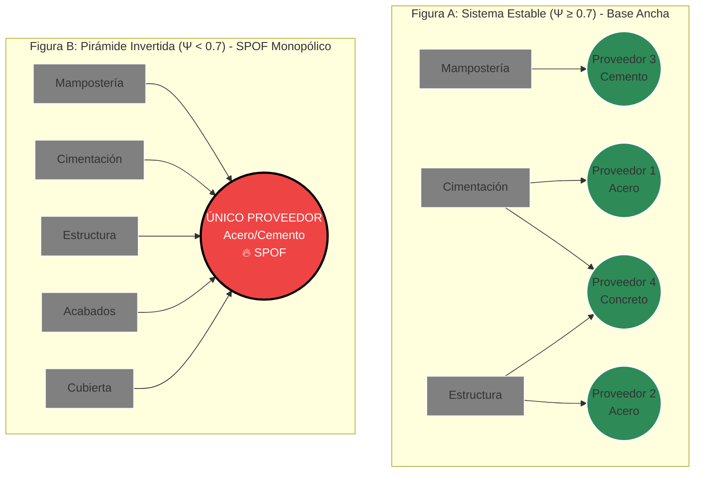

--------------------------------------------------------------------------------
🕸️ topologia.md: La Geometría del Riesgo y la Topología de la Variedad
"Un edificio no se cae porque sus ladrillos sean baratos; se cae porque sus conexiones fallan. APU_filter ignora el precio para ver la forma, revelando la fragilidad oculta que el Excel clásico no puede mostrar."
--------------------------------------------------------------------------------

En el ecosistema de la Fortaleza Matemática de **APU Filter v5.0**, el presupuesto de obra deja de ser un listado plano de ítems contables para convertirse formalmente en un **2-Complejo Simplicial Abstracto** $K$ sobre el anillo de los enteros $\mathbb{Z}$, donde:
- **Vértices (0-símplices):** insumos atómicos y APUs individuales.
- **Aristas (1-símplices):** dependencias binarias entre pares (APU $\to$ Proveedor / Insumo).
- **Triángulos (2-símplices):** interdependencias ternarias (APU $\leftrightarrow$ Proveedor $\leftrightarrow$ Actividad) que emergen de compromisos contractuales trilaterales.

Todo este diseño se subordina axiomáticamente a la **Ley de Clausura Transitiva de la pirámide DIKW** (tabla canónica): $V_{\aleph_0} \subsetneq V_{\mathbb{P}} \subsetneq V_{\mathbb{T}} \subsetneq V_{\mathbb{S}} \subsetneq V_{\mathbb{W}}$. Este documento consolida el Esqueleto Táctico (**Nivel 2 — 𝕋 TACTICS, Las Murallas Topológicas**), respaldado computacionalmente por `app/tactics/business_topology.py` y auditado por `TopologicalControlSurfaceAgent` y `BoundaryRingSheafAgent`.

---

## 🚘 La Analogía del Automóvil y el Seguro de Vida (Para la Mesa de Juntas)

Para el Comité de Licitaciones y la Alta Gerencia de Obra Civil, la topología algebraica no es una abstracción teórica; es el **freno de emergencia ABS** que previene el colapso financiero:

> *“Un vehículo comercial no se evalúa por la estética del manual de usuario, sino porque sus frenos ABS detendrán el chasis en piso mojado para salvar la vida de los ocupantes. En APU Filter, los invariantes topológicos ($\beta_0, \beta_1, \beta_2, \chi, \Psi$) son los sensores giroscópicos que detectan si la estructura logísitica se está volcando antes de que el dinero desaparezca en el fango de la obra real.”*

---

## 1. Los Invariantes Topológicos (El ADN del Proyecto) y El Tensor de Curvatura de Calibre

Utilizamos homología computacional sobre $\mathbb{Z}$ para calcular los Números de Betti ($\beta_n$), los cuales son invariantes matemáticos que describen la conectividad fundamental de la red de valor.

Se integra el **Funtor de Curvatura de Yang-Mills**. La anomalía topológica se detecta a través del **Cálculo Exterior Discreto (DEC)** y la **Derivada Covariante Exterior Matricial $D_A$**:
$$ D_A F = \delta F + [A \wedge F] \equiv 0 $$
Esto certifica matemáticamente la invarianza de Gauge en el transporte paralelo de las decisiones de negocio.

### $\beta_0$: Componentes Conexas (Fragmentación y Fricción Logística)
* **El Ideal:** $\beta_0 = 1$. Un proyecto unificado donde cada insumo fluye coherentemente hacia el objetivo final.
* **La Patología ($\beta_0 > 1$):** Islas de Datos. Existen subgrafos desconectados o recursos huérfanos.
* **Impacto de Negocio ("Dolor y Dinero"):** Fragmentación logística pura. Se están comprando materiales que no están enlazados a ninguna actividad constructiva. Es dinero "ciego", desperdicio o riesgo de facturación fantasma en SECOP II.

### $\beta_1$: Ciclos Independientes (Trampas Lógicas) y Homología Regenerativa
* **El Ideal:** $\beta_1 = 0$. El flujo del proyecto es laminar y conforma un Grafo Acíclico Dirigido (DAG) perfecto.
* **La Patología Parasitaria ($\beta_1^- > 0$):** Socavones Lógicos. Dependencias circulares o grafos cíclicos prohibidos (ej. Muro $\to$ Ladrillo $\to$ Flete $\to$ Muro). Imposibilidad matemática de calcular un costo unitario real.
* **El Agente 3R (Ciclo Homológico Regenerativo $\beta_1^+$):** Un ciclo $\gamma$ con $[\gamma] \neq 0 \in H_1(K;\mathbb{Z})$ se clasifica como **Regenerativo** ($\beta_1^+$) ssi satisface tres condiciones simultáneas:
  1. *Certificación DPP:* Pasaporte Digital de Producto acredita circularidad material lícita (Reusar/Reciclar).
  2. *Coste neto no positivo:* $C(\gamma) = \sum_{e \in \gamma} c(e) \le 0$.
  3. *Desigualdad de Clausius discreta:* $\sum_{e \in \gamma} \frac{\Delta G_{\text{Gibbs},e}}{T} \le 0$ (la entropía neta es exportada al entorno).
  Los ciclos que no cumplan las tres condiciones se clasifican como $\beta_1^-$ (Socavones Lógicos) y son vetados.

### $\beta_2$: Cavidades Ternarias (Interdependencias Trilaterales)
* **El Ideal:** $\beta_2 = 0$. No existen grupos cerrados de tres entidades con dependencia mutua irresoluble.
* **La Patología ($\beta_2 > 0$):** Cavidades Cerradas. Emergen cuando tres actores (APU, Proveedor, Actividad) forman un circuito de interdependencia tal que ninguno puede operar o sustituirse independientemente (ej. mezcla, transporte y vaciado). Exige reestructuración trilateral.

### $\chi$: Característica de Euler-Poincaré Extendida
$$\chi = \beta_0 - \beta_1 + \beta_2 = |V| - |E| + |F|$$
Cuantifica la "Entropía Estructural" del proyecto. Sirve como métrica para el Pricing Dinámico SaaS: a mayor $|\chi|$ con $\chi < 0$, mayor es el peaje termodinámico asignado por colapsar esa complejidad.

---

## 2. La Física del Equilibrio: Índice de Estabilidad Piramidal ($\Psi$)

El microservicio `business_topology.py` analiza el centro de gravedad del negocio mediante la métrica $\Psi$. Un proyecto de construcción resiliente debe emular una pirámide termodinámica estable.

$$\boxed{\Psi := \frac{\left(\sum_{j=1}^{n} \deg(p_j)\right)^2}{n \cdot \sum_{j=1}^{n} \deg(p_j)^2}}$$

Esta fórmula representa el **Número Efectivo de Proveedores** y satisface $\Psi \in (0, 1]$:
* $\Psi = 1$: Distribución perfectamente uniforme (máxima resiliencia).
* $\Psi \to 1/n$: Único proveedor monopólico que soporta todas las APUs (**Pirámide Invertida extrema**).
* **Umbral de Veto:** $\Psi < \Psi_{\mathrm{min}}$ (recomendado $\Psi_{\mathrm{min}} = 0.7$ bajo mandato BIM 2026).
* **Impacto de Negocio ("Dolor y Dinero"):** Si el proveedor monopólico de acero entra en paro, todo el megaproyecto colapsa, generando multas diarias por retraso e inhabilitación en SECOP II. El Arquitecto emite VETO TÉCNICO INMEDIATO.


```mermaid
graph TD
    classDef stable fill:#2e8b57,stroke:#fff,stroke-width:2px;
    classDef spof fill:#ef4444,stroke:#000,stroke-width:3px,color:#fff;
    classDef apu fill:#808080,stroke:#fff,stroke-width:1px;

    subgraph "Figura A: Sistema Estable (Ψ ≥ 0.7) - Base Ancha"
        APU1_A[Mampostería]:::apu
        APU2_A[Cimentación]:::apu
        APU3_A[Estructura]:::apu

        P1_A((Proveedor 1<br>Acero)):::stable
        P2_A((Proveedor 2<br>Acero)):::stable
        P3_A((Proveedor 3<br>Cemento)):::stable
        P4_A((Proveedor 4<br>Concreto)):::stable

        APU1_A --> P3_A
        APU2_A --> P4_A
        APU2_A --> P1_A
        APU3_A --> P2_A
        APU3_A --> P4_A
    end

    subgraph "Figura B: Pirámide Invertida (Ψ < 0.7) - SPOF Monopólico"
        APU1_B[Mampostería]:::apu
        APU2_B[Cimentación]:::apu
        APU3_B[Estructura]:::apu
        APU4_B[Acabados]:::apu
        APU5_B[Cubierta]:::apu

        SPOF((ÚNICO PROVEEDOR<br>Acero/Cemento<br>🔥 SPOF)):::spof

        APU1_B --> SPOF
        APU2_B --> SPOF
        APU3_B --> SPOF
        APU4_B --> SPOF
        APU5_B --> SPOF
    end
```

---

## 3. Estabilidad Espectral: El Valor de Fiedler ($\lambda_2$)

Analiza el espectro propio de la Matriz Laplaciana ($L = D - A$) del Complejo Simplicial:
* **Métrica:** Conectividad algebraica $\lambda_2$ (Valor de Fiedler del Laplaciano Combinatorio).
* **Diagnóstico:** Si $\lambda_2 \approx 0$, el sistema diagnostica una **"Fractura Organizacional"**, revelando clústeres masivos unidos por un solo hilo logístico frágil que se romperá bajo estrés del mercado.

---

## 4. La Inmunidad de Fusión: Mayer-Vietoris, Defectos de Pegado y Torsión sobre $\mathbb{Z}$

Al unir distintas bases de datos de presupuestos ($A \cup B$), el ecosistema ejecuta una Auditoría Homológica mediante la secuencia exacta larga de Mayer-Vietoris:
$$\dots \to H_1(A) \oplus H_1(B) \to H_1(A \cup B) \xrightarrow{\partial^*} H_0(A \cap B) \to \dots$$

* **Defecto de Pegado (*Gluing Defect*):** Un nuevo ciclo en $A \cup B$ es la imagen inversa del operador de coborde $\partial^*$ actuando sobre componentes conexas fragmentadas en $A \cap B$.
* **El Funtor de Torsión $\operatorname{Tor}(H_0, \mathbb{Z})$:** Como los insumos son indivisibles (ladrillos, bultos), se reduce la matriz de incidencia a la **Forma Normal de Smith (SNF)** sobre $\mathbb{Z}$:
  $$B = U \cdot \operatorname{diag}(d_1, d_2, \dots, d_r, 0, \dots, 0) \cdot V$$
  Los factores invariantes $d_i > 1$ revelan **Subgrupos de Torsión** $\operatorname{Tor}(H_{k-1}; \mathbb{Z}) = \bigoplus \mathbb{Z}/d_i\mathbb{Z}$. Un ciclo de torsión diagnostica de forma determinista incompatibilidades geométricas de empaquetado discreto de materiales y fricción de escala cuantizada, forzando veto antes de la compra.

---

## 5. Dinámica de la Superficie de Control: Replicador de Shahshahani y Flujo Brockett

En el Estrato Wisdom ($V_{\mathbb{W}}$), el soberano `topological_control_surface_agent.py` gobierna de forma continua y no conmutativa el acoplamiento de la topología táctica ($\text{MIC}$) y el espacio de Hilbert ($\text{MAC}$):

1. **Continuización Replicadora de Shahshahani (MIC):**
   $$\frac{dp_i}{dt} = p_i \left[ (\mathbf{e}_i^\top \tilde{\mathcal{K}} \mathbf{p}) - \mathbf{p}^\top \tilde{\mathcal{K}} \mathbf{p} \right], \quad \mathbf{p} \in \Delta^{n-1}$$
2. **Purificación Espectral Isospectral de Brockett (MAC):**
   $$\frac{d\rho}{dt} = \left[ \rho, \, [\rho, \, \mathcal{N}(\mathbf{p})] \right], \quad \mathcal{N}(\mathbf{p}) = \operatorname{diag}(\mathbf{p})$$
3. **Contracción de Lyapunov e Identidad de Variancia:**
   $$\mathcal{H}(\mathbf{p}, \rho) = -\frac{1}{2}\mathbf{p}^\top \tilde{\mathcal{K}}\mathbf{p} + S(\rho) \implies \dot{\mathcal{H}} = -\mathrm{Var}_{\mathbf{p}}(\tilde{\mathcal{K}}\mathbf{p}) \le 0$$
   Si $\dot{\mathcal{H}} > 10^{-12}$, el retículo colapsa a VETOED ($\top$), activando el Crowbar perimetral en silicio ($<400\text{ ns}$).

---

## 6. Homología de Frontera Abierta ($\partial K \subset K$), Causalidad CPTP y Bell-CHSH

El soberano `boundary_ring_sheaf_agent.py` y su reactor `boundary_ring_sheaf.py` gobiernan el contorno $\partial \mathcal{M} \neq \varnothing$ sobre el **Haz de Anillos Topológicos Localizados** $\mathbf{Sh}(\partial \mathcal{M}, \mathcal{R}_{\partial M})$ sobre el Anillo de Novikov $\Lambda_{\mathrm{Nov}}$:

1. **Torsión Homológica de Frontera sobre $\mathbb{Z}$:**
   Exige $\operatorname{Tor}(H_{k-1}(\partial K; \mathbb{Z})) \equiv \mathbf{0} \iff d_i = 1 \, \forall d_i > 0$ en la Smith Normal Form de $B$.
2. **Causalidad CPTP de Choi e Invariantes Bell-CHSH:**
   Exige $\lambda_{\min}(C_{\mathcal{E}}) \ge -10^{-12}$, $\|\operatorname{Tr}_2(C_{\mathcal{E}}) - \mathbf{I}\|_F \le 10^{-4}$ y parámetro de Bell-CHSH acotado por Tsirelson $\mathcal{B}_{\mathrm{CHSH}} \le 2\sqrt{2}$.
3. **Metabolismo Lindblad-GKSL en el Espacio de Fock:**
   Amortiguación de amplitud con operadores de Kraus sobre el qubit semántico, extirpando alucinaciones a la tasa $\Gamma = \Gamma_0 / (1 + 10 \cdot \mathbf{1}_{\mathrm{torsion}} + 4 \frac{\mathrm{leak}}{1+\mathrm{leak}})$.

---

## 7. El Espejo Parabólico Semántico (Operador de Householder) y Salto de Kraus

Para blindar el Estrato Ω contra alucinaciones, el sistema activa `semantic_parabolic_mirror.py`. Cuando $\beta_1 > 0$ o $\beta_2 > 0$, construye un vector normal ortogonal $|n\rangle$ y aplica el **Operador de Householder** $\hat{M}$:
$$\hat{M} = I - 2 \frac{|n\rangle \langle n|}{\langle n \mid n \rangle}$$
Toda alucinación "rebota" hacia el espacio nulo de la decisión.

Síncronamente, el Agente de Bogoliubov construye **Operadores de Salto de Kraus-Lindblad** ($\hat{L}_i = \sqrt{\bar{\gamma}_i} |0\rangle \langle \psi_i|$) para purgar errores hacia el vacío $|0\rangle$, preservando la pureza de la matriz de conocimiento.

---

## 8. La Rampa de Confianza Graduada y Actuación Ciber-Física en Silicio

Para conciliar la rigidez matemática con las exigencias del frente de obra civil (evitando detener el bombeo de concreto por fluctuaciones estocásticas menores y previniendo que la mezcla se seque dentro de las tuberías hidráulicas), la variedad topológica discrimina dos regímenes de censura:

```
  [ PAYLOAD INCIDENTE EN EL REACTOR DE FRONTERA ]
                         │
                         ▼
        ¿Divergencia o anomalía espectral?
                         │
         ┌───────────────┴───────────────┐
         ▼ (Sí)                          ▼ (No)
  ¿La transgresión es irreversible?   [COHERENT]
  (Choi < -10⁻⁴, d_i > 1, Fraude)     - Emisión de firma SHA-256
         │                            - Flujo óptimo en obra
   ┌─────┴─────────────────────┐
   ▼ (No: Ruido menor)         ▼ (Sí: Inestabilidad/Dolo)
[VETO SUAVE - LUZ ÁMBAR]     [VETO DURO - CROWBAR BT151]
- Alerta visual en panel     - Colapso Heyting Ω₃ ↦ VETOED (⊤)
- Override humano (1 h)      - Conmutación GPIO14 (< 400 ns)
- Solicitud de ajuste        - Paralización de maquinaria en seco
```

1. **Veto Suave (Luz Ámbar de Telemetría):** Se activa ante fluctuaciones marginales del mercado o desvíos transitorios ($\Psi = 0.69 < \Psi_{\min}=0.70$). La potencia en obra se mantiene activa mientras se enciende una baliza estroboscópica y se otorga **1 hora** a la interventoría para firmar un **Positrón de Autorización Humana** $e^+$ que aniquila la anomalía semántica $e^-$.
2. **Veto Duro (Frenado por Hardware ESP32 Crowbar < 400 ns):** Reservado para rupturas irreversibles ($\operatorname{Tor}(H_k) \neq \mathbf{0}$, $\lambda_{\min}(C_{\mathcal{E}}) < -10^{-4}$, o divergencia de Lyapunov $\dot{\mathcal{H}} > 10^{-4}$). El retículo de Heyting colapsa a VETOED ($\top$), ejecutando la **ISR en memoria IRAM del ESP32 en $<400\text{ ns}$**, conmutando **GPIO14** y disparando el tiristor **BT151** para paralizar la maquinaria pesada en seco antes de consolidar el desfalco.

---

## 9. Actuación Ciber-Física en Silicio (ESP32 Crowbar < 400 ns)

Si el veredicto en Heyting colapsa al Supremo terminal VETOED ($\top$):
1. Se aplica la reducción monoidal $\mu : \Omega_3 \to \mathbb{Z}_2$.
2. La rutina local C++ `isVerdictCoherent()` valida el pasaporte de telemetría firmado SHA-256.
3. Ante veto ($\top \mapsto 1$), la **ISR en memoria IRAM** del microcontrolador **ESP32** conmuta el pin **GPIO14** en menos de **$400\,\text{ns}$**.
4. Dispara el tiristor de potencia **BT151 (Crowbar circuit)**, cortocircuitando la línea de potencia y paralizando síncronamente la maquinaria pesada en obra.

---

**Sello de Coherencia Topológica de la Variedad:**
$$\mathtt{SuturaSignature} = \operatorname{SHA-256}\left(\mathbf{Sh}(\partial \mathcal{M}, \mathcal{R}_{\mathrm{Novikov}}) \wedge \operatorname{Tor}(H_k; \mathbb{Z}) \wedge \mathcal{B}_{\mathrm{CHSH}} \wedge \dot{\mathcal{H}}_{\mathrm{Lyapunov}} \wedge \mathtt{ESP32-Crowbar}\right)$$
